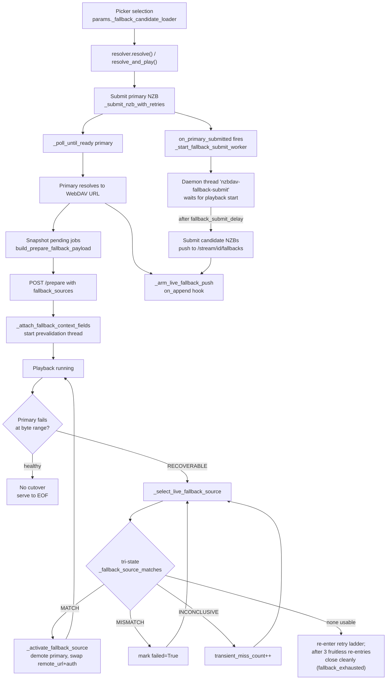
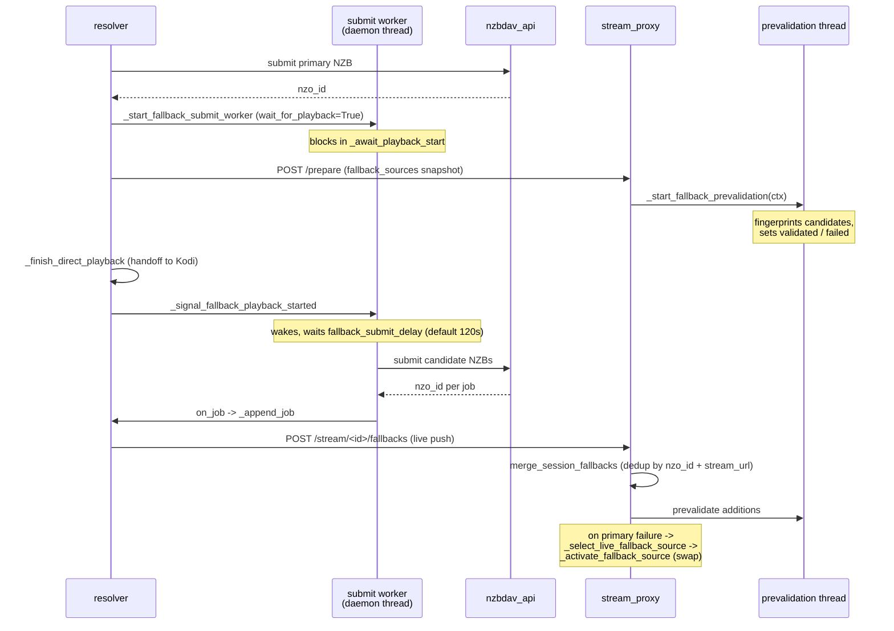

# nzbdav Kodi Addon — Stream-Fallback System

> Contributor-level code map of the multi-tier stream-fallback mechanism. All
> module paths are relative to `repo/plugin.video.nzbdav/resources/lib/`.
> References name modules and functions rather than line numbers: the
> 2.0.0-beta.1 refactor split `resolver.py`, `stream_proxy.py`, and
> `fallback_streams.py` into sibling modules, and line numbers drift. Grep for
> the names below.
>
> User-level docs: [Fallback streams](https://appz4fun.github.io/nzbdavkodi/features/fallback-streams/)
> and [Fallback cutover](https://appz4fun.github.io/nzbdavkodi/how-it-works/fallback-cutover/).

## Overview

The stream-fallback system submits alternate Usenet releases as *standby
candidates* during playback and automatically switches to one when the primary
stream fails at a byte range. Main components:

| Component | Modules | Role |
|-----------|---------|------|
| Candidate discovery | `router.py`, `router_fallback.py`, `hydra.py` | builds the deferred per-selection candidate loader; optionally augments the pool with NZBHydra2 duplicate uploads |
| Candidate gating | `fallback_streams.py` + `fallback_streams_identity.py`, `fallback_streams_match.py`, `fallback_streams_attach.py`, `fallback_streams_select*.py`, `fallback_streams_probe.py` | content-identity + metadata gates, tiering, post-date dedup, fingerprint ranges, prepare payload |
| Resolver orchestration | `resolver.py` + `resolver_entry.py`, `resolver_fallback.py`, `resolver_fallback_jobs.py`, `resolver_flow.py`, `resolver_playback.py` | drives the flow, owns `fallback_state`, arms the live push |
| Stream proxy | `stream_proxy.py` + `stream_proxy_handler_cutover.py`, `stream_proxy_handler_probe.py`, `stream_proxy_mgr_*.py`, `stream_proxy_fallback.py`, `stream_proxy_const.py` | serves bytes, prevalidates, executes the live cutover |
| Dead-candidate tracking | `dead_candidates.py` | per-session set of provably-dead releases |
| Backend submit | `nzbdav_api.py`, `resolver_submit.py` | submits NZB jobs to nzbdav |

The lifecycle is deliberately lazy: a healthy playback that never stalls
submits **zero** fallback candidates. Backups are only fetched well after the
video is confirmed playing, so the burst never contends with the fragile
startup cache-fill window.

Relevant settings (Advanced → Fallback Streams): **Enable fallback streams**
(`fallback_streams_enabled`, default on), **Maximum standby fallback streams**
(`fallback_streams_max`, default 5, clamped to 0–5), and **Seconds into
playback before submitting fallback backups** (`fallback_submit_delay`,
default 120; added in 2.0.0-beta.1).

### End-to-end lifecycle



### Background-worker interactions



The `fallback_state` dict built by `_start_fallback_submit_worker`
(`resolver_fallback.py`: `lock`, `jobs`, `stop`, `finished`,
`playback_started`, `thread`, `cancel_job`) is the shared channel between the
resolver and the worker. The proxy session's `ctx` dict holds `remote_url`,
`auth_header`, `fallback_sources`, `fallback_active_index`,
`fallback_switch_count` (initialised by `_attach_fallback_context_fields` in
`stream_proxy_fallback.py`), and per-cutover validation hints. The
`DeadCandidates` set (`dead_candidates.py`, keyed by NZB URL and nzo_id) is
threaded through every path to exclude poisoned candidates.

## Candidate Selection

Candidates come from the **picker's search-result pool** for the selected
release. When NZBHydra2 is in use, the pool is also augmented with same-title
alternate uploads from Hydra's internal search API
(`hydra.fetch_release_duplicate_uploads`, POST `/internalapi/search`,
fail-soft). The router builds a deferred loader
(`router._fallback_candidate_loader_for_selection` →
`router_fallback._compute_fallback_candidates`), which runs
`attach_fallback_candidates_for_selection` (`fallback_streams_select.py`) only
for the release you picked. The resolver starts that loader on its own daemon
thread (`nzbdav-fallback-candidate-prefetch`,
`resolver_fallback._prefetch_fallback_candidate_loader`) so the primary submit
isn't blocked. `attach_fallback_candidates(results)` still exists for
whole-pool attachment.

**Gates** (`_fallback_peer_matches`, `fallback_streams_match.py`), in order:

1. Different, non-empty NZB link.
2. Different article digest: exact re-uploads are rejected (only when both
   digests exist).
3. `_same_content()` (`fallback_streams_identity.py`), the authoritative
   content-identity gate: title / year / seasons / episodes / part / edition /
   proper / repack.
4. `_title_profile_gate_passes()`: short-circuits if the prefetch gate already
   matched this pair; otherwise `_titles_look_related()` and then
   `_metadata_profiles_match(require_same_group=True)`.
5. `_fallback_manifest_peer_matches()`: manifest group-key equality, or a
   metadata-only allowance when a manifest is unsupported as `too_large`, or
   the ±10% group-bytes tolerance (`_PEER_BYTES_TOLERANCE_FRACTION = 0.10`)
   for video/archive payloads.

**Tier ranking** (`_release_similarity`, `fallback_streams_identity.py`).
Every tier hard-rejects (returns `None`) when `_same_content()` fails:

- **Tier 0**: same resolution + codec + group, size within 3%
  (`_TIER0_SIZE_FRACTION = 0.03`).
- **Tier 1**: same resolution + codec. Tier classification applies no size
  tolerance of its own; the ±10% gate lives in
  `_fallback_manifest_peer_matches()`.
- **Tier 2**: same resolution, different codec.
- **Tier 3**: same content, anything else.

When `require_same_group=True` (`_same_group_resolution_gate`), both the
**group** and the **resolution** must parse and be equal. This fails closed:
an unknown or unparsed group or resolution is rejected.

`_manifest_group_key()` returns `(kind, name, size)` for video or
`(kind, name)` for archive, and requires kind, name, and article digest to be
present. Archive keys omit size, so a shared archive base name bypasses the
byte tolerance. **The key itself does NOT include the article digest.** Digest
dedup is a separate mechanism (`seen_article_digests` in
`fallback_streams_attach.py` and the selection streaming path).

Maximum fallbacks: `_MAX_FALLBACKS = 5` (`fallback_streams.py`). The
`fallback_streams_max` setting is clamped to `0.._MAX_FALLBACKS`
(`fallback_streams_select._fallback_settings`).

> Note on gate ordering: the prefetch gate (`first_prefetchable_fallback_peer`
> → `_prefetch_peer_match*`) runs `_metadata_profiles_match` and the
> title-token check *before* `_same_content`. `_fallback_peer_matches` runs
> `_same_content` *first*. The admission set is the same, but don't assume the
> two paths match check-for-check when you trace one of them.

### Duplicate-proneness

**Same-post-date, different-group, or different-resolution duplicates are not
submitted as fallbacks** on the active (`require_same_group=True`) path:

- **Same-post-date dedup.** `_dedupe_candidates_by_pubdate()`
  (`fallback_streams_attach.py`) collapses candidates whose Usenet post dates
  fall within `_SAME_POST_WINDOW_SECONDS` (3600 s, inclusive) of each other
  down to the best-ranked survivor. It also drops any candidate within that
  window of the primary's own post date. Clustering is anchor-based, so a chain
  of near-posts doesn't merge transitively. It runs in both ranking paths
  (`_attach_candidates_for_target`, `_rank_fallback_candidates`) before the
  `_MAX_FALLBACKS` clamp. Candidates with no parseable `pubdate` are always
  kept.
- **Article-digest dedup only fires when both digests exist and are equal.** If
  either digest is missing, the check is skipped. The content-identity and
  group/resolution gates are then the only defense.
- If a path ran with `require_same_group=False`, the group/resolution rejection
  wouldn't apply. Two releases from the same posting time with different
  groups could then both pass, as long as they satisfy `_same_content()`.

## Submission Timing

Fallback submission is a **two-stage, deliberately delayed** process anchored
to **playback start**, not to picker selection or primary submission.

**Trigger point.** Submission is armed when the primary NZB is submitted.
`_poll_until_ready()` (`resolver_pollloop.py`) calls the `on_primary_submitted`
hook, which is `_ResolveSideEffects.start_fallback_after_primary`
(`resolver_entry.py`). That hook launches `_start_fallback_submit_worker()`
with `wait_for_playback=True` and `prewarm_delay` set from
`_get_fallback_submit_delay_seconds()`.

**The worker.** A daemon thread named `nzbdav-fallback-submit`, stored as
`state['thread']`. It doesn't submit right away. It first blocks in
`_await_playback_start(state)`, which is capped at
`_FALLBACK_PLAYBACK_WAIT_CAP_SECONDS = 300` so a missed signal degrades to a
late submit.

**The deliberate delay.** After playback is handed off to Kodi
(`_finish_direct_playback`), both handoff paths in `resolver_flow.py` call
`_signal_fallback_playback_started(fallback_state)`. The worker then waits for
`prewarm_delay` in `_wait_prewarm_or_inactive()`. That wait aborts early when
`state['stop']` is set. It also aborts when the cross-process `nzbdav.playing`
window property, once seen live, is cleared (playback stopped during the
standby window).

```python
# resolver.py
_FALLBACK_PREWARM_DELAY_SECONDS = 120
```

The delay comes from the `fallback_submit_delay` setting. An empty, invalid, or
negative value falls back to the 120 s default, and `0` submits right at
playback start. Only after the delay does `_submit_fallback_candidates()` run.
It appends each job to `state['jobs']` and fires the `on_job` hook.

**Live adoption.** `_arm_live_fallback_push()` (`resolver_playback.py`) installs
an `on_append` hook that calls `update_stream_fallbacks_via_service()`
(`stream_proxy_service.py`). That call POSTs newly adopted jobs to
`http://127.0.0.1:{port}/stream/{session_id}/fallbacks` with a 3 s timeout.
The service handler (`stream_proxy_handler_dispatch.py`) calls
`merge_session_fallbacks()` (`stream_proxy_mgr_sessions.py`), which dedups by
`(nzo_id, stream_url)` and prevalidates the additions.

**Cancellation.** `_stop_fallback_submit_worker()` (`resolver_fallback_jobs.py`)
sets `state['stop']` and joins the thread with a timeout. Both the
playback-start wait and the prewarm wait check `stop`, so an aborted session
submits nothing.

The `resolve()` (setResolvedUrl) and `resolve_and_play()` (service-side) paths
behave the same way for fallback submission.

## Byte-Stream Verification

A fallback candidate may take over only once it's proven **byte-identical**.
The proof is `content_length` equality plus SHA-256 fingerprints of sampled
byte ranges.

**Stage 1: content_length equality.** A source whose `content_length` differs
from the expected length is a definitive MISMATCH
(`_fallback_source_matches`, `stream_proxy_handler_probe.py`). Every fallback
payload entry carries `content_length` (`build_prepare_fallback_payload`).

**Stage 2: fingerprinting.** `_fingerprint_ranges_for_length()`
(`fallback_streams_probe.py`) builds the sample ranges:

- `content_length <= 4096`: one range, `(0, content_length-1)`.
- Sample count: 100 ranges for files of 1 GiB or more
  (`_FINGERPRINT_SAMPLE_COUNT`), 20 for smaller files
  (`_FINGERPRINT_SMALL_SAMPLE_COUNT`). Each range is 4096 bytes
  (`_FINGERPRINT_BYTES`).
- If the file is no larger than `sample_count * 4096`, it's tiled
  contiguously.
- Otherwise, the first and last 4 KiB windows are always included, and the
  remaining starts are chosen deterministically from
  `sha256("{content_length}:{counter}")`.

A digest that's present and different is a MISMATCH. An empty digest, a probe
5xx, or a timeout is INCONCLUSIVE.

**Eager vs lazy validation.** Both happen:

- **Eager (prevalidation thread).** `_start_fallback_prevalidation`
  (`stream_proxy_mgr_prefetch.py`) warms candidates *before* any failure. The
  loop skips sources that are already `failed` or `validated`, and sets
  `validated = True` after a successful prevalidation. The thread is a daemon
  and is **never joined before cutover**.
- **Lazy (at cutover).** A source that's already `validated` skips the full
  fingerprint and only probes the current range. A lazy full match also sets
  `validated = True`.

**The `validated` flag** means the source was byte-proven in this session, so
it isn't fingerprinted again. It's also stamped on a **demoted** primary at
cutover (`_demote_active_source`, `stream_proxy_handler_cutover.py`). That
source was actively serving these exact bytes, so it's identical by
construction. Without the flag, the prevalidation warmer would fingerprint it
again on a fresh upstream open.

**Offset preservation on cutover.** `_activate_fallback_source()`
(`stream_proxy_handler_cutover.py`) does the following:

- Demotes the active source into `ctx["fallback_sources"]` with
  `demoted=True, validated=True`.
- Swaps `ctx["remote_url"]` to the fallback's `stream_url` and
  `ctx["auth_header"]` to its `Authorization` header.
- Clears the upstream-down notice flags.
- Resets the throughput window (`passthrough_window_t0`,
  `passthrough_window_bytes`) and the AWAITING_DOWNLOAD streak
  (`_awaiting_download_no_progress`).
- Increments `fallback_switch_count` and sets `fallback_active_index`.

`ctx["current_byte_pos"]` isn't touched. It's managed separately by
`_update_current_byte_pos`, so playback resumes at the exact offset. The
cutover log line is
`NZB-DAV: Switched pass-through source at byte {} to fallback nzo_id={} (switch_count={})`.
A primary stuck on AWAITING_DOWNLOAD with no progress for
`_AWAITING_DOWNLOAD_NO_PROGRESS_MAX = 3` consecutive reads fails over through
the same function and logs `Primary stuck on no-progress AWAITING_DOWNLOAD …`.

**Failure handling is tri-state** (`_apply_fallback_match_result`):

- **MATCH**: activate.
- **MISMATCH** (different `content_length` or digest): `failed = True`
  permanently. Any definitive answer resets the transient counter.
- **INCONCLUSIVE**: increment `transient_miss_count`. The source is abandoned
  (`failed = True`) only when
  `misses > _FALLBACK_SOURCE_TRANSIENT_MISS_MAX` (4, `stream_proxy_const.py`).
  That means **after exceeding 4 misses, on the 5th**, not on the 4th.

Failed sources are skipped during selection.

**Exhaustion.** When no source is usable, the proxy re-enters the retry ladder
so a transient trickle can still recover. It gives up only after
`_FALLBACK_PENDING_FALLTHROUGH_MAX = 3` consecutive fall-throughs with no new
real upstream bytes. It then closes cleanly with
`terminal_reason="fallback_exhausted"` (log: `Fallback chain exhausted at byte …`).
