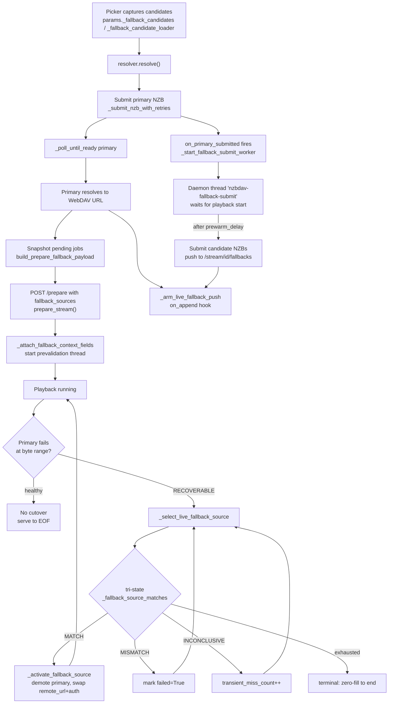
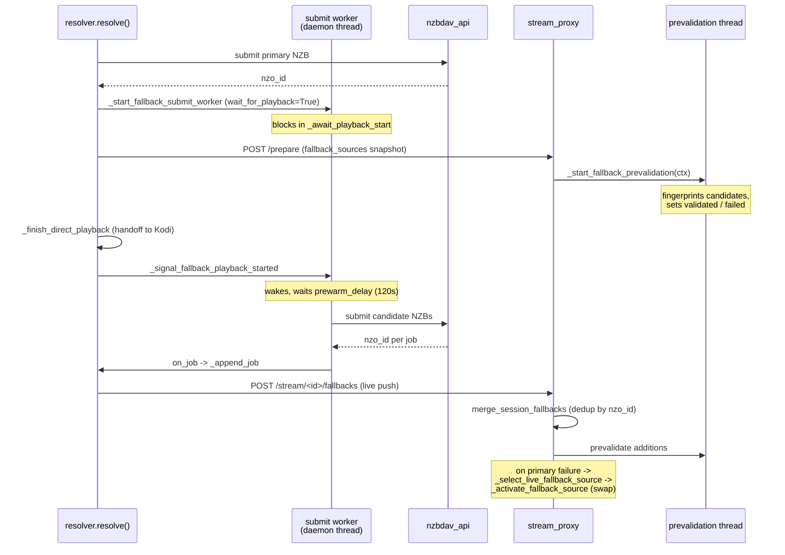

# nzbdav Kodi Addon — Stream-Fallback System

> Definitive reference for the multi-tier stream-fallback mechanism. All
> file:line references point into `repo/plugin.video.nzbdav/resources/lib/`.

## Overview

The stream-fallback system submits alternate Usenet releases as *standby
candidates* during playback and automatically switches to one when the primary
stream fails at a byte range. It spans five components:

| Component | File | Role |
|-----------|------|------|
| Resolver / orchestration | `resolver.py` | drives the flow, threads `fallback_state`, arms live push |
| Candidate gating | `fallback_streams.py` | content-identity + metadata gates, fingerprinting, payload build |
| Stream proxy | `stream_proxy.py` | serves bytes, prevalidates, executes the live cutover |
| Dead-candidate tracking | `dead_candidates.py` | permanently blacklists provably-dead releases per session |
| Backend submit | `nzbdav_api.py` | submits NZB jobs to nzbdav |

The lifecycle is deliberately lazy: a healthy playback that never stalls
submits **zero** fallback candidates. Backups are only fetched well after the
video is confirmed playing, so the burst never contends with the fragile
startup cache-fill window.

### End-to-end lifecycle



### Background-worker interactions



The `fallback_state` dict (`resolver.py:2966-2974`: `lock`, `jobs`, `stop`,
`finished`, `playback_started`, `thread`, `cancel_job`) is the shared channel
between the resolver and the worker. The `ctx` dict is the proxy session's
master state (`stream_proxy.py:8018-8026`), holding `remote_url`,
`auth_header`, `fallback_sources`, `fallback_active_index`,
`fallback_switch_count`, and per-cutover validation hints. The
`DeadCandidates` set (`dead_candidates.py:22-40`) is threaded through every
path to exclude poisoned candidates.

## Candidate Selection

Candidates originate from the **same search-result pool** that the picker
passes to the resolver — not a separate indexer query
(`fallback_streams.py:2011-2042`, `attach_fallback_candidates(results)`). They
are filtered through strict content-identity gates and then ranked by a
similarity tier.

**Gates** (`fallback_streams.py:1376-1404`, `_fallback_peer_matches`):

1. Different NZB link (`:1380`)
2. Different article digest (`:1385`) — exact re-uploads rejected
3. `_same_content()` — the authoritative content-identity gate
   (`:1388-1391`, defined `:629-743`): title / year / seasons / episodes /
   part / edition / proper / repack
4. Title-token relatedness via `_titles_look_related()` (`:1394`)
5. `_metadata_profiles_match(require_same_group=True)` (`:1401`)
6. `_fallback_manifest_peer_matches()` (`:1404`)

**Tier ranking** (`fallback_streams.py:746-777`, `_release_similarity`) — all
tiers hard-reject (return `None`) if `_same_content()` fails (`:756`):

- **Tier 0** — same resolution + codec + group + size within 3% (`:770-773`)
- **Tier 1** — same resolution + codec (`:769-774`). *Note:* tier
  classification does **not** itself enforce a size tolerance; the ~10% size
  tolerance (`_PEER_BYTES_TOLERANCE_FRACTION = 0.10`, `:1416`) is deferred to
  `_fallback_manifest_peer_matches()` (`:1520`), not the tier check.
- **Tier 2** — same resolution, different codec (`:775-776`)
- **Tier 3** — same content, anything else (`:777`)

When `require_same_group=True` (`_metadata_profiles_match`, `:1238-1252`) both
the **group** and the **resolution** must parse and be equal — fail-closed:
unknown/unparsed group or resolution is rejected (`:1239-1242`, `:1249-1252`).

`_manifest_group_key()` (`:1293-1313`) returns `(kind, name, size)` for video
or `(kind, name)` for archive. Archive matches short-circuit on
`archive_base_name` alone (`:1491-1496`); video matches bypass the size
tolerance when the key matches (`:1497-1500`). **The manifest key does NOT
include the article digest** — digest dedup is a *separate* mechanism in
`_attach_candidates_for_target()` (`seen_article_digests`, `:1688-1691`,
`:1704-1705`).

Maximum fallbacks: `_MAX_FALLBACKS = 5` (`:84`), clamped via the
`fallback_streams_max` setting (`:1562`).

> Note on gate ordering: `first_prefetchable_fallback_peer()`
> (`:1137-1214`) and `_fallback_peer_matches()` enforce the gates in
> **different sequences**. `first_prefetchable_fallback_peer` runs
> `_metadata_profiles_match` (`:1163-1170`) → title tokens (`:1173-1174`) →
> `_same_content` (`:1175`), whereas `_fallback_peer_matches` runs
> `_same_content` *first* (`:1390-1391`) then the title/group checks. The end
> result is the same admission set, but a developer tracing one path should
> not assume the other matches order-for-order.

### Duplicate-proneness

**Direct answer: same-post-date / different-group / different-resolution
duplicates are NOT submitted as fallbacks.** Same-post-date collapsing is now
explicit (`_dedupe_candidates_by_pubdate()`, see Honest gaps below). On top of
that, when `require_same_group=True` (the active prefetch path),
different-group *or* different-resolution candidates are rejected outright at
`fallback_streams.py:1239-1252`.

**Honest gaps:**

- **Same-post-date dedup IS enforced.** `_dedupe_candidates_by_pubdate()`
  (`fallback_streams.py`) collapses candidates whose Usenet post dates fall
  within `_SAME_POST_WINDOW_SECONDS` (3600s, inclusive) of each other down to a
  single survivor (highest similarity tier kept), and drops any candidate within
  that window of the primary's own post date. Anchor-based clustering means a
  chain of near-posts does not transitively merge. Runs in both ranking paths
  (`_attach_candidates_for_target`, `_rank_fallback_candidates`) before the
  `_MAX_FALLBACKS` clamp. Candidates with no parseable `pubdate` are treated as
  always-distinct and are never collapsed.
- **Article-digest dedup only fires when BOTH digests exist and are equal**
  (`:1383-1386`). If either side's digest is missing, the digest check is
  skipped; the content-identity and group/resolution gates remain the only
  defense.
- If a legacy or non-prefetch path runs with `require_same_group=False`, the
  different-group / different-resolution rejection no longer applies, and two
  releases from the same posting time with different groups *could* both pass
  provided they satisfy `_same_content()`.

## Submission Timing

Fallback submission is a **two-stage, deliberately delayed** process anchored
to **playback start**, not picker selection and not primary submission.

**Trigger point.** Submission is armed at *primary NZB submission* time:
`_submit_nzb_with_retries()` returns, then `on_primary_submitted(nzo_id)` fires
inside `_poll_until_ready()` (`resolver.py:3533-3535`). That callback is
`_start_fallback_after_primary` (resolve path `:3667-3678`, resolve_and_play
path `:3807-3824`), which launches the worker via
`_start_fallback_submit_worker()`.

**The worker.** A daemon thread named `nzbdav-fallback-submit`
(`resolver.py:3059-3063`), stored as `state['thread']`, runs until
`state['stop']` is set. It does **not** submit immediately — both paths pass
`wait_for_playback=True` (`:3675`, `:3816`). The worker first blocks in
`_await_playback_start(state)` (`:3010-3013`).

**The deliberate delay.** After playback is handed off to Kodi,
`_signal_fallback_playback_started(fallback_state)` is called (resolve `:3754`,
resolve_and_play `:3924`), setting the `playback_started` event (`:2927-2934`).
The worker then waits an additional `prewarm_delay` via
`state['stop'].wait(prewarm_delay)` (`:3012`):

```python
# resolver.py:2869
_FALLBACK_PREWARM_DELAY_SECONDS = 120
```

> "Seconds INTO playback to hold the fallback prewarm/submit burst. Anchored
> to actual playback start (not primary submission, which can precede playback
> by a whole download for a slow primary), so backups are only fetched well
> after the video is established: a working playback that never needs them
> submits none, and the burst never contends with the fragile startup
> cache-fill window." — `resolver.py:2863-2868`

The delay is configurable via the `fallback_submit_delay` setting, passed as
`prewarm_delay` (`:3674`, `:3813`). Only after it elapses does
`_submit_fallback_candidates()` run (`:3041-3049`), appending each job to
`state['jobs']` (`:2986`) and firing the `on_job` hook (`:2798`).

**Parallel candidate loading.** `_prefetch_fallback_candidate_loader()`
(`:2817-2860`) loads candidates on its own daemon thread during the primary
download, so the worker is not blocked when the delay expires.

**Live adoption.** `_arm_live_fallback_push()` (`:530-576`, armed at `:3750` /
`:3920`) installs an `on_append` hook (`:575`) that calls
`update_stream_fallbacks_via_service()` (`stream_proxy.py:8942-8967`),
POSTing newly-adopted jobs to `http://127.0.0.1:{port}/stream/{session_id}/fallbacks`
(3s timeout). The handler `_handle_fallback_update()`
(`stream_proxy.py:2405-2466`) calls `merge_session_fallbacks()`.

**Cancellation.** `_stop_fallback_submit_worker()` (`:3158-3179`) sets
`state['stop']`; both the playback-start wait and the prewarm wait check
`stop.is_set()` and return early, so an aborted session submits nothing.

Both `resolve()` (setResolvedUrl) and `resolve_and_play()` (service-side)
paths are functionally identical for fallback submission.

## Byte-Stream Verification

Fallback candidates are verified to be **byte-identical** before they are
allowed to take over, using `content_length` equality plus SHA256
fingerprinting of sampled byte ranges.

**Stage 1 — content_length equality.** Two sources are eligible for comparison
only if their `content_length` values are exactly equal
(`stream_proxy.py:3778-3783`; immediate rejection on inequality). Every
fallback record carries `content_length` (`fallback_streams.py:2198`).

**Stage 2 — fingerprinting.** `_fingerprint_ranges_for_length()`
(`fallback_streams.py:2209-2235`):

- For `content_length <= 4096`: a single range `(0, content_length-1)`.
- For larger files: up to 100 ranges, each 4096 bytes, distributed
  deterministically by a seed `hashlib.sha256("{}:{}".format(content_length, counter))`.

Digests are compared at `stream_proxy.py:4141-4167`:
`if primary_digest != fallback_digest: return _FALLBACK_MISMATCH`.

**Eager vs lazy validation.** Both occur:

- **Eager (prevalidation thread)** — warms candidates *before* any failure.
  The loop skips already-resolved sources:
  `if source.get("failed") or source.get("validated"): continue`
  (`stream_proxy.py:3864`), and sets `source["validated"] = True` after a
  successful prevalidation (`:3917`). This thread is a daemon and is **never
  joined before cutover**.
- **Lazy (at cutover)** — `if source.get("validated")` skips the full
  fingerprint and only probes the current range (`:3787`), setting
  `source["validated"] = True` after a lazy match (`:3850`).

**The `validated` flag** means a source has been byte-proven (all sampled
digests matched) *in this session*; it prevents re-fingerprinting. It is also
stamped on a **demoted** primary at cutover (`stream_proxy.py:3298-3302`,
`:3319`): that source was just actively serving these exact bytes, so it is
content-identical by construction — without the flag the prevalidation warmer
would re-fingerprint it on a fresh upstream open.

**Offset preservation on cutover.** `_activate_fallback_source()`
(`stream_proxy.py:3285-3360`) swaps `ctx["remote_url"] = fallback["stream_url"]`
and the `auth_header` (`:3322-3323`), demotes the dead primary into
`ctx["fallback_sources"]` with `demoted=True, validated=True` (`:3303-3321`),
and resets throughput / AWAITING_DOWNLOAD counters (`:3330-3335`,
`passthrough_window_t0`, `passthrough_window_bytes`,
`_awaiting_download_no_progress`). The byte position `ctx["current_byte_pos"]`
persists unchanged across the swap — it is managed separately by
`_update_current_byte_pos` (`:2086`, `:2113-2114`, `:2143`) — so playback
resumes at the exact offset (cutover log: "Switched pass-through source at byte
{}", `:3350-3351`). `fallback_switch_count` and `fallback_active_index` are
updated (`:3336-3342`).

**Failure handling — tri-state** (`_apply_fallback_match_result`,
`stream_proxy.py:3363-3390`):

- **MATCH** → activate.
- **MISMATCH** (different content_length or digest) → `source["failed"] = True`
  permanently (`:3389`), counter reset (`:3386-3387`).
- **INCONCLUSIVE** → increment `transient_miss_count`. The source is abandoned
  (`source["failed"] = True`, `:3381`) only when
  `misses > _FALLBACK_SOURCE_TRANSIENT_MISS_MAX`
  (`_FALLBACK_SOURCE_TRANSIENT_MISS_MAX = 4`, `:291`; check at `:3378`) — i.e.
  **after exceeding 4 misses, on the 5th**, not on the 4th.

Failed sources are permanently skipped during selection:
`if source.get("failed"): continue` (`stream_proxy.py:3405`).
