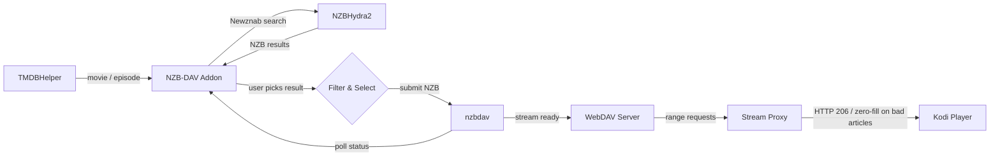
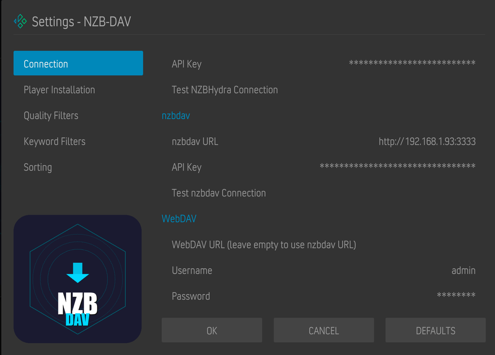

# NZB-DAV Kodi Addon

[](https://github.com/Appz4Fun/nzbdavkodi/actions/workflows/ci.yml)
[](https://github.com/Appz4Fun/nzbdavkodi/actions/workflows/codeql.yml)
[](https://github.com/Appz4Fun/nzbdavkodi/actions/workflows/release.yml)
[](https://coderabbit.ai)
[](https://www.gnu.org/licenses/gpl-3.0)
[](https://kodi.tv/)
[](https://www.python.org/)

A Kodi 21 (Omega) player/resolver addon that enables Usenet-based streaming through NZBHydra2 (or Prowlarr) and nzbdav. Works as a TMDBHelper player -- search for a movie or TV episode, pick an NZB, and stream it directly through nzbdav's WebDAV server.

## Start Here

If you already have NZBHydra2 or Prowlarr and nzbdav running, follow the
[Quickstart](docs/quickstart.md) first. It covers the setup order that matters:
install NZB-DAV, enter service credentials, install the TMDBHelper player file,
refresh TMDBHelper players, set movie and TV defaults, and verify first
playback.

If something does not appear in TMDBHelper or playback does not start, use the
[Troubleshooting guide](docs/troubleshooting.md).

See [CHANGELOG.md](CHANGELOG.md) for the current release notes and full
per-release history.

## How It Works



No separate SABnzbd needed -- nzbdav handles both downloading and serving.

## Requirements

| Component | Description |
|-----------|-------------|
| **Kodi 21 (Omega)** | Or later |
| **NZBHydra2** *or* **Prowlarr** | At least one indexer aggregator running and accessible |
| **nzbdav** | Running and accessible (provides SABnzbd-compatible API + WebDAV) |
| **TMDBHelper** | To trigger searches |
| **ffmpeg** *(recommended)* | Required for force-remux. Without it the proxy falls back to pass-through for all files. |

## Installation

### Via Kodi Repository (recommended)

Install through the NZB-DAV repository for automatic updates:

1. In Kodi: **Settings > File Manager > Add source** > enter `https://appz4fun.github.io/nzbdavkodi/` > name it `nzbdav`
2. **Settings > Add-ons > Install from zip file** > `nzbdav` > the latest `repository.nzbdav-*.zip` shown at the source root
3. **Settings > Add-ons > Install from repository > NZB-DAV Repository > Video add-ons > NZB-DAV**
4. Future updates are installed automatically

### Manual Install

1. Download the addon zip from the [releases page](https://github.com/Appz4Fun/nzbdavkodi/releases)
2. In Kodi: **Settings > Add-ons > Install from zip file** > select `plugin.video.nzbdav.zip`

---

## TMDBHelper Setup

For first-time setup, follow the [Quickstart](docs/quickstart.md). The important
order is:

1. Install TMDBHelper.
2. Configure NZB-DAV service credentials.
3. In NZB-DAV settings, click **Install TMDBHelper Player**.
4. Restart Kodi or run TMDBHelper **Players > Update players**.
5. Set **Default player (Movies)** and **Default player (TV Shows)** to
   **NZB-DAV**.
6. Verify by playing one known movie or episode from TMDBHelper.

If NZB-DAV does not appear as a player, see
[Troubleshooting](docs/troubleshooting.md#nzb-dav-does-not-appear-in-tmdbhelper).

---

## Configuration

Open the addon settings (**Add-ons > My add-ons > Video add-ons > NZB-DAV > Configure**):



### Connection Settings

| Setting | Where to find it |
|---------|-----------------|
| Enable NZBHydra2 | Enable if you use NZBHydra2 |
| NZBHydra2 URL | URL to your NZBHydra2 instance (e.g., `http://192.168.1.100:5076`) |
| NZBHydra2 API Key | NZBHydra2 web UI > `http://<hydra>:5076/config/main` > **Security** section > **API key** |
| nzbdav URL | URL to your nzbdav instance (e.g., `http://192.168.1.100:3333`) |
| nzbdav API Key | nzbdav web UI > `http://<nzbdav>/settings` > **Usenet** tab > **API Key** |
| WebDAV URL | Clear this field when WebDAV uses the nzbdav URL; only enter a separate WebDAV base URL if your nzbdav setup exposes one |
| WebDAV Username | nzbdav web UI > `http://<nzbdav>/settings` > **WebDAV** tab > **Username** |
| WebDAV Password | nzbdav web UI > `http://<nzbdav>/settings` > **WebDAV** tab > **Password** |

#### Prowlarr (optional, alternative to NZBHydra2)

Enable **Prowlarr** in addon settings to use Prowlarr as the search backend instead of (or alongside) NZBHydra2:

| Setting | Description |
|---------|-------------|
| Enable Prowlarr | Turn on Prowlarr search |
| Prowlarr URL | URL to your Prowlarr instance (e.g., `http://localhost:9696`) |
| Prowlarr API Key | Prowlarr web UI > **Settings > General > Security** > API Key |
| Prowlarr Indexer IDs | Comma-separated indexer IDs to query (leave blank for all) |
| Test Prowlarr Connection | Action button — verifies URL + API key + indexer reachability |

> **Tip for entering long API keys:** Use a Kodi remote app with keyboard support (e.g., Sybu on iPhone). Navigate to the nzbdav/NZBHydra2/Prowlarr settings page on your computer, copy the key, then paste from your clipboard into the Kodi input field via the remote app's on-screen keyboard.

### Player Installation

Click **Install TMDBHelper Player** to install the `nzbdav.json` player to TMDBHelper. This registers NZB-DAV as a playback source in TMDBHelper's player selection menu. The player is installed directly to TMDBHelper's players directory.

### Quality Filters

All filters default to **everything enabled** -- deselect what you don't want.

| Filter | Options |
|--------|---------|
| Resolution | 2160p, 1080p, 720p, 480p |
| HDR | HDR10, HDR10+, Dolby Vision, HLG, SDR |
| Audio | Atmos, TrueHD, DTS-HD MA, DTS:X, DD+, DD, AAC |
| Video Codec | x265/HEVC, x264/AVC, AV1, VP9, MPEG-2 |
| Language | EN, ES, FR, DE, IT, PT, NL, RU, JA, KO, ZH, AR, HI |

### Keyword Filters

| Setting | Description |
|---------|-------------|
| Preferred release groups | Comma-separated (e.g., `SPARKS,FGT,NTb`) -- boosted to top |
| Excluded release groups | Comma-separated -- removed from results |
| Min file size | In MB (0 = no limit) |
| Max file size | In MB (0 = no limit) |
| Exclude keywords | Comma-separated |
| Require keywords | Comma-separated |

### Sort & Display

| Setting | Options | Default |
|---------|---------|---------|
| Sort by | Relevance, Size (largest/smallest), Age (newest/oldest) | Relevance |
| Max results | 1--100 | 25 |

### Relevance Sort Order

When sorted by relevance, results are ranked by priority:

| Priority | Criteria | Ranking |
|----------|----------|---------|
| 1 | Resolution | 4K > 1080p > 720p > 480p |
| 2 | HDR | Dolby Vision > HDR10+ > HDR10 > HLG > SDR |
| 3 | Preferred group | Configured groups boosted |
| 4 | Audio | TrueHD+Atmos > Atmos DD+ > TrueHD > DTS:X > DTS-HD MA > DTS > DD+ > DD > AAC |
| 5 | Size | Largest first |

### Polling

| Setting | Description | Default |
|---------|-------------|---------|
| Poll interval | Seconds between status checks | 1 |
| Download timeout | Max wait time in seconds | 3600 |
| Submit timeout | Max wait for nzbdav submit-NZB API to respond (seconds) | 300 |

### Search Cache

| Setting | Description | Default |
|---------|-------------|---------|
| Cache duration | Seconds to cache search results (0 to disable) | 300 |
| Clear Cache | Available from addon main menu | -- |

### Auto-Select

| Setting | Description | Default |
|---------|-------------|---------|
| Auto-select best match | Automatically pick the top result and skip the selection dialog | Off |

### Advanced

These tune stream-proxy behaviour. Defaults are safe; only flip these if you have a reason.

| Setting | Description | Default |
|---------|-------------|---------|
| Enable fallback streams | Submit conservative duplicate releases in the background and keep them as standby streams for live proxy switching | On |
| Maximum standby fallback streams | Maximum standby releases attached per primary result | 5 |
| Large non-MP4 stream mode | `Direct pass-through (default)` / `fMP4 HLS (compatibility, experimental)` / `Matroska remux (compatibility)` | Direct pass-through |
| Force ffmpeg remux above (MB, 0=off) | File size above which the proxy switches to the optional force-remux tier; `0` disables non-MP4 force-remux entirely, including unknown-length streams | 15000 (~15 GB) |
| Convert MP4 subtitles to SRT | mov_text → SRT during remux so embedded subs survive the matroska/HLS pipeline | On |
| Strict upstream contract mode | How to react when nzbdav responds with HTTP shapes that violate the strict Range/Content-Length contract: `Off` / `Warn only` / `Enforce` | Warn only |
| Enable density breaker | Abort streams where recovery zero-fill exceeds 50% of a sliding window (catches dead releases early) | Off |
| Enable zero-fill budget | Cap total per-stream zero-fill bytes; stream terminates with a clean error when the budget is hit | On |
| Enable retry ladder before skip probe | Re-issue the original Range request with backoff on transient upstream errors before falling back to skip-fill | On |
| Send 200 for no-range pass-through | Send `200 OK` instead of always `206 Partial Content` when Kodi requests a full object. **Off by default** until validated on the target build. | Off |

---

## Playing A Title

1. Open **TMDBHelper** and browse to a movie or TV episode
2. Select **Play with NZB-DAV**
3. Pick an NZB from the full-screen results dialog
4. Wait for the download to complete (progress dialog shows status)
5. Playback starts automatically from nzbdav's WebDAV server

### Results Dialog

The results dialog shows all matching NZBs with color-coded quality labels, sorted by relevance. Each row displays the release name, resolution, codec, audio format, release type, file size, age, indexer, and release group.


The status bar at the bottom shows how many sources passed your filters. Use **Enter** to download and play, **C** for the context menu, or **Esc** to go back.

With **Auto-select best match** enabled, the dialog is skipped and the top result plays automatically.

---

## Stream Proxy

Every playback request is routed through a local HTTP proxy (`stream_proxy.py`) running on a random port in the background service. Kodi never talks to the WebDAV server directly, which sidesteps a PROPFIND parent-directory scan that caused `Open - Unhandled exception` errors on several Kodi builds.

The proxy picks one of four paths based on the container, fallback metadata, file size, and the configured large non-MP4 stream mode:

1. **MP4 (already faststart)** -- served through the local pass-through proxy, preserving native range seeking while keeping proxy session tracking available for fallback/rescue handling.
2. **MP4 (moov at tail)** -- parsed in pure Python via HTTP range requests, `stco` and `co64` chunk offsets rewritten (so 4 GB+ MP4s work on 32-bit Kodi), and served as a virtual faststart MP4 with `Accept-Ranges: bytes`. If parsing fails, falls back to an ffmpeg tempfile remux.
3. **MKV and other containers (default path)** -- served as a byte pass-through with ranged upstream fetches. Kodi gets native seeking from the source file's real Cues, and the proxy layers zero-fill recovery on top: when an upstream read fails mid-stream, it probes forward to the next readable offset, writes zero bytes across the gap, and keeps streaming.
4. **Optional compatibility tier** -- when **Large non-MP4 stream mode** is set to Matroska remux or fMP4 HLS and the stream is above the non-zero threshold, the proxy uses ffmpeg:
   - **Matroska remux** -- `ffmpeg -c copy -f matroska pipe:1`, unsized. Known-good on Dolby Vision HEVC + TrueHD/Atmos 100 GB REMUXes. Seek is approximate (each seek respawns ffmpeg with `-ss`).
   - **fMP4 HLS** -- produces an HLS VOD playlist with per-segment `hvc1`-tagged fMP4 + a canonical `init.mp4` that survives seek respawns. Gives full random seek across multi-hundred-gigabyte sources. **Self-healing**: if ffmpeg fails to start or doesn't produce a valid init segment within 30 s, the proxy automatically rewrites the session to the matroska branch *before* Kodi sees a broken URL.

**Dolby Vision routing matrix** (applied within the compatibility tier): P5, P7 FEL, P8, and unknown-DV sources are routed to **matroska** (the safest option on Amlogic CAMLCodec). P7 MEL and confirmed non-DV are eligible for **fMP4 HLS** when that mode is selected. P7 FEL specifically is forced to matroska because fMP4 cannot carry dual-layer HEVC.

If ffmpeg isn't installed, the proxy degrades gracefully to pass-through.

> **Architecture deep-dive:** [`docs/proxy-architecture.md`](docs/proxy-architecture.md)
> documents the full session lifecycle, proxy tier selection, HLS producer
> internals, and debugging entry points. That page is contributor-level
> internals with historical context; this README remains the current
> user-facing behavior summary.

### Live Fallback Streams

When **Enable fallback streams** is enabled, the resolver attaches conservative duplicate candidates from the result list and submits them after the primary NZB is accepted. This is enabled by default. Standby submits run in a background worker so primary playback can continue polling immediately. Once playback starts, the proxy keeps the fallback job metadata with the session and can switch to another prepared stream if the active source becomes unrecoverable.

Fallback grouping is based on the NZB manifest's selected payload entry, not the search result size. The addon fetches each candidate NZB, prefers the main video filename and file-level segment-byte total when visible, and falls back to a provisional archive/RAR grouping key when only archive parts are visible. If the parser cannot extract a usable video entry from an otherwise plausible candidate, the addon can synthesize conservative video evidence from the indexer's reported size when it is at least 100 MB. Candidates with the same selected payload Article Message-IDs, or the same link-derived synthetic digest, are treated as mirrored copies of the same NZB and are not used as fallbacks.

Before fetching a candidate NZB for selection-time fallback evidence, the addon also rejects candidates whose indexer-reported sizes are more than +/-25% away from the selected result. This is intentionally wider than the manifest match gate because indexer sizes can include RAR/PAR2 overhead, but it avoids downloading large NZBs for obvious size mismatches.

Runtime switching still requires exact WebDAV `Content-Length` equality and 1000 pseudo-random 4096-byte fingerprint samples before the proxy switches to a fallback source. **Maximum standby fallback streams** caps how many standby submits are attached per primary result and defaults to `5`.

Fallback recovery is the only rescue path for fallback sessions: if no validated fallback source can resume the failed range, the proxy closes the stream instead of retrying the original source, zero-filling, or probing forward to skip bytes.

Compatibility remux remains available for environments that need ffmpeg compatibility paths, but pass-through is the default. Setting **Force ffmpeg remux above (MB, 0=off)** to `0` disables non-MP4 remux entirely, including unknown-length streams.

---

## More Documentation

- [Quickstart](docs/quickstart.md) - first-time setup with existing backend services.
- [Troubleshooting](docs/troubleshooting.md) - common setup, search, WebDAV, and playback issues.
- [Architecture overview](docs/architecture.md) - contributor map of search, resolve, and proxy flows.
- [Proxy architecture](docs/proxy-architecture.md) - deep internals for playback/proxy work.

---

## Development

For a contributor-facing map of the search, resolve, and stream proxy paths, see
the [architecture overview](docs/architecture.md).

### Prerequisites

- [uv](https://docs.astral.sh/uv/) — runs the pinned test/lint tooling on Python 3.14 (`make-dev` and every `just` test/lint recipe invoke it)
- Kodi addon runtime remains Python 3.8+
- [just](https://github.com/casey/just) (command runner)

### Commands

```bash
just test              # Run the default non-integration pytest suite
just test-verbose      # Run unit tests with full output
just test-integration  # Run integration tests against a real ffmpeg binary
just lint              # Check ruff + black formatting
just lint-fix          # Auto-fix lint issues
just release           # Build plugin.video.nzbdav.zip
just ship              # Run tests then build release
just repo              # Build release + generate local Pages preview in pages-dist/
just repo-zip          # Build repo + copy repository zip to cwd
just clean             # Remove build artifacts
just dist-clean        # Remove build artifacts + generated Pages preview
```

### Project Structure

```text
repo/plugin.video.nzbdav/
  addon.xml              # Kodi addon manifest
  addon.py               # Entry point
  service.py             # Background service (stream proxy + playback monitor)
  resources/
    settings.xml         # Kodi settings UI
    lib/
      router.py            # URL routing
      hydra.py             # NZBHydra2 API client
      prowlarr.py          # Prowlarr API client (alternative indexer)
      nzbdav_api.py        # nzbdav API client
      webdav.py            # WebDAV availability checker
      filter.py            # Result filtering with PTT
      results_dialog.py    # Custom full-screen results dialog
      resolver.py          # Download + polling orchestrator
      stream_proxy.py      # Local HTTP proxy -- pass-through, MP4 rewrite, optional remux
      mp4_parser.py        # Pure-Python MP4 moov / stco / co64 rewriter
      dv_source.py         # Dolby Vision source probe (profile / RPU detection)
      dv_rpu.py            # DV RPU NAL parser
      cache.py             # JSON-based search result cache
      fallback_streams.py  # Duplicate release fallback selection and payloads
      cache_prompt.py      # Legacy cache compatibility prompt helpers
      kodi_advancedsettings.py  # Probe Kodi's advancedsettings.xml cache settings
      player_installer.py  # TMDBHelper player JSON installer
      http_util.py         # Shared HTTP utilities
      i18n.py              # Localization helper
      ptt/                 # Vendored PTT library (parse-torrent-title)
    language/             # Kodi localization files
    skins/Default/
      1080i/results-dialog.xml  # Dialog skin XML
      media/white.png           # Texture for backgrounds
scripts/
  build_zip.py           # Addon zip builder
  generate_repo.py       # Kodi repo metadata generator
  select_stable_release.py  # Pages workflow release selector
repo/
  repository.nzbdav/     # Repository addon descriptor pointing to Pages metadata
.github/workflows/
  ci.yml                 # Lint + test on 3.14 + a 3.8 compileall gate, on push/PR
  release.yml            # Build GitHub Releases on version tags
  pages.yml              # Publish Kodi repository metadata to GitHub Pages
  codeql.yml             # CodeQL analysis
  bandit.yml             # Bandit security scan
tests/
  conftest.py                       # Kodi module mocks
  test_*.py                         # Default unit test suite
  test_integration_hls_ffmpeg.py    # 2 integration tests (real ffmpeg, opt-in)
TODO.md                             # Active backlog
```

### Releasing

1. Bump `version` in `repo/plugin.video.nzbdav/addon.xml`
2. Run `just lint` and `just test`.
3. Commit the version bump:
   `git add repo/plugin.video.nzbdav/addon.xml`
4. Commit: `git commit -m "release: v0.X.0"`
5. Tag and push: `git tag v0.X.0 && git push origin main v0.X.0`
6. GitHub Actions builds the zip and creates a GitHub Release.
7. The Pages workflow republishes the tagged stable release into Kodi repository metadata.
8. Kodi picks up the update automatically from the GitHub Pages repository.

Prerelease tags such as `v1.2.3-beta.1` may create GitHub Release artifacts, but
the Pages workflow skips publishing them to the public Kodi repository.

---

## Compatibility

| Platform | Supported |
|----------|-----------|
| Kodi | 21 (Omega) and later |
| Python | 3.8+ |
| OS | CoreELEC, LibreELEC, OSMC, Windows, macOS, Linux |
| Architecture | ARM64 (aarch64), x86_64 |
| Dependencies | None -- all vendored, no pip required |

---

## License

GPLv3 -- see [LICENSE](LICENSE) for details.
