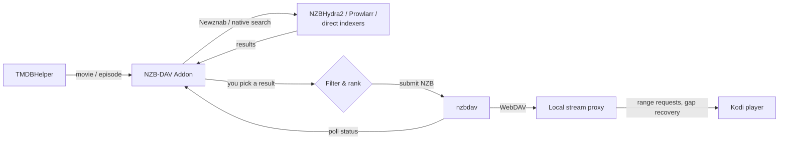

# NZB-DAV Kodi Addon

[](https://github.com/Appz4Fun/nzbdavkodi/actions/workflows/ci.yml)
[](https://github.com/Appz4Fun/nzbdavkodi/actions/workflows/codeql.yml)
[](https://github.com/Appz4Fun/nzbdavkodi/actions/workflows/release.yml)
[](https://github.com/Appz4Fun/nzbdavkodi/actions/workflows/pages.yml)
[](https://www.gnu.org/licenses/gpl-3.0)
[](https://kodi.tv/)
[](https://www.python.org/)

A Kodi 21 (Omega) player/resolver add-on that streams Usenet media through
[TMDBHelper](https://github.com/jurialmunkey/plugin.video.themoviedb.helper). You
browse a movie or TV episode in TMDBHelper, pick an NZB, and NZB-DAV searches
your indexers, downloads through [nzbdav](https://github.com/nzbdav-dev/nzbdav),
and streams the file — with a progress bar, seeking, and automatic recovery when
a source goes bad. No manual NZB handling required.

> **This add-on provides software, not content.** You bring your own indexers
> (NZBHydra2, Prowlarr, or direct Newznab), your own nzbdav server, and your own
> Usenet provider.

## 📖 Full documentation

**This README is the short version. The complete guide — every setting, every
feature, and a technical breakdown of how it all works — lives at:**

### 👉 [appz4fun.github.io/nzbdavkodi](https://appz4fun.github.io/nzbdavkodi/)

There you'll find [getting-started walkthroughs](https://appz4fun.github.io/nzbdavkodi/getting-started/prerequisites/),
a [complete settings reference](https://appz4fun.github.io/nzbdavkodi/reference/settings/),
[feature guides](https://appz4fun.github.io/nzbdavkodi/features/),
and a [technical "how it works" section](https://appz4fun.github.io/nzbdavkodi/how-it-works/architecture/)
with architecture diagrams.

## How it works



nzbdav handles both downloading and serving over WebDAV — no separate SABnzbd
needed. A background stream proxy adds seeking, on-the-fly remuxing, and
mid-playback source switching.

## Requirements

| Component | Description |
|-----------|-------------|
| **Kodi 21 (Omega)** | Or later |
| **nzbdav** | Running and reachable (SABnzbd-compatible API + WebDAV) |
| **NZBHydra2**, **Prowlarr**, *or* **direct Newznab indexers** | At least one search provider |
| **TMDBHelper** | To browse titles and trigger playback |
| **ffmpeg** *(recommended)* | Enables the optional remux tiers; without it the proxy uses pass-through |

See [Prerequisites](https://appz4fun.github.io/nzbdavkodi/getting-started/prerequisites/)
for details.

## Installation

### From the Appz4Fun Kodi repository (recommended)

NZB-DAV is distributed through the
[Appz4Fun Kodi repository](https://github.com/Appz4Fun/Appz4Fun-Kodi-Repo), which
delivers automatic updates on a **Stable** or **Beta** channel.

1. Open [appz4fun.github.io/Appz4Fun-Kodi-Repo](https://appz4fun.github.io/Appz4Fun-Kodi-Repo/)
   and download the channel zip (for example `repository.appz4fun.stable-1.0.0.zip`).
2. In Kodi: **Settings → System → Add-ons** → enable **Unknown sources**.
3. **Settings → Add-ons → Install from zip file** → select the channel zip.
4. **Settings → Add-ons → Install from repository → Appz4Fun Repository** →
   install **NZB-DAV**. Future updates install automatically.

### Manual install

Download `plugin.video.nzbdav.zip` from the
[releases page](https://github.com/Appz4Fun/nzbdavkodi/releases), then
**Settings → Add-ons → Install from zip file**. Manual installs don't
auto-update.

Full steps: [Install the add-on](https://appz4fun.github.io/nzbdavkodi/getting-started/installation/).

## Quick setup

1. Open **My add-ons → Video add-ons → NZB-DAV → Configure** and enter your
   **nzbdav** URL + API key and **WebDAV** credentials. Use the **Test** actions.
2. Enable a search provider (NZBHydra2, Prowlarr, or direct indexers) and test it.
3. On the **Player Installation** tab, select **Install TMDBHelper Player**.
4. Restart Kodi (or run TMDBHelper **Players → Update players**), then set
   **Default player (Movies)** and **Default player (TV Shows)** to **NZB-DAV**.
5. Play a title from TMDBHelper.

Full walkthrough:
[Configure connections](https://appz4fun.github.io/nzbdavkodi/getting-started/configuration/) ·
[Set up TMDBHelper](https://appz4fun.github.io/nzbdavkodi/getting-started/tmdbhelper/) ·
[Play your first title](https://appz4fun.github.io/nzbdavkodi/getting-started/first-playback/).

## Key features

- **Multi-provider search** across NZBHydra2, Prowlarr, and direct Newznab
  indexers, merged and de-duplicated.
- **Quality filtering and ranking** by resolution, HDR, audio, codec, language,
  release group, size, and keywords.
- **A local stream proxy** that preserves seeking, rewrites tail-`moov` MP4s in
  pure Python, recovers from missing articles, and offers optional Matroska
  remux and fMP4 HLS tiers for large or Dolby Vision files.
- **Self-healing fallback streams** that switch to a verified, byte-identical
  alternate release mid-playback without stopping or rewinding.
- **Optional NZBGet backend** as an alternative to nzbdav.

Each feature is documented in full under
[Features](https://appz4fun.github.io/nzbdavkodi/features/).

## Troubleshooting

If NZB-DAV doesn't appear in TMDBHelper, no results show, or playback fails, see
the [Troubleshooting guide](https://appz4fun.github.io/nzbdavkodi/operations/troubleshooting/).
See [CHANGELOG.md](CHANGELOG.md) for release notes.

## Development

Requires [uv](https://docs.astral.sh/uv/) (runs the pinned test/lint toolchain)
and [just](https://github.com/casey/just). Addon runtime code stays Python 3.8+
and pure Python.

```bash
just test          # Run the default unit test suite
just lint          # ruff + black + pylint + vermin
just lint-fix      # Auto-fix lint/format issues
just release       # Build plugin.video.nzbdav.zip
just ship          # Test, then build the release zip
just docs          # Build the documentation site into ./site (strict)
just docs-serve    # Serve the docs site locally with live reload
```

Contributor orientation: [AGENTS.md](AGENTS.md) ·
architecture and internals:
[How it works](https://appz4fun.github.io/nzbdavkodi/how-it-works/architecture/) and
[`docs/proxy-architecture.md`](docs/proxy-architecture.md).

### Project structure

```text
repo/plugin.video.nzbdav/     # The Kodi add-on (installed via zip)
  addon.xml                   # Add-on manifest
  addon.py / service.py       # Entry point + background service (stream proxy)
  resources/
    settings.xml              # Kodi settings UI
    lib/                      # Runtime modules (router, search, resolver, proxy, ...)
    language/                 # Localization
docs-site/                    # MkDocs documentation source (GitHub Pages)
mkdocs.yml                    # Docs site config
docs/                         # Contributor deep-dives (proxy internals, DV/HLS notes)
scripts/                      # Addon zip build + PR-review helpers
tests/                        # pytest suite (Kodi mocks in conftest.py)
.github/workflows/            # ci.yml, release.yml, pages.yml (docs), security scans
```

### Releasing

1. Bump `version` in `repo/plugin.video.nzbdav/addon.xml`.
2. Update `CHANGELOG.md` and `repo/plugin.video.nzbdav/changelog.txt`.
3. Run `just lint` and `just test`.
4. Commit, then tag and push: `git tag vX.Y.Z && git push origin main vX.Y.Z`.

The Release workflow builds the zip and creates a GitHub Release, then notifies
the [Appz4Fun Kodi repository](https://github.com/Appz4Fun/Appz4Fun-Kodi-Repo) to
rebuild and republish. Pre-release tags are published to the Beta channel.

## Compatibility

| Platform | Supported |
|----------|-----------|
| Kodi | 21 (Omega) and later |
| Python | 3.8+ |
| OS | CoreELEC, LibreELEC, OSMC, Windows, macOS, Linux |
| Architecture | ARM64 (aarch64), x86-64 |
| Dependencies | None — all vendored, no pip required |

## License

GPLv3 — see [LICENSE](LICENSE) for details.
