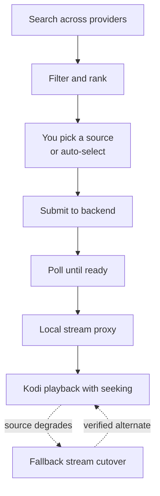

# Features overview

NZB-DAV is a player and resolver: it finds a Usenet source for the title you
picked, downloads it through your backend, and streams it into Kodi with a set
of reliability features built for imperfect Usenet retention and low-powered
devices.

## The feature areas

-   :material-magnify: __[Search and indexers](search-and-indexers.md)__

    Query NZBHydra2, Prowlarr, and direct Newznab indexers. See how queries are
    built, how id-based TV/movie search works, and how results are merged.

-   :material-filter-variant: __[Quality filtering and sorting](quality-filtering.md)__

    Keep only the resolutions, HDR formats, codecs, audio, and languages you
    want. Rank by relevance, size, or age, and optionally auto-select the best.

-   :material-play-speed: __[Playback, remux, and seeking](playback-and-remux.md)__

    A local proxy preserves seeking, rewrites tail-`moov` MP4s, recovers from
    missing articles, and offers optional remux and HLS tiers for tough files.

-   :material-swap-horizontal: __[Fallback streams](fallback-streams.md)__

    When a source degrades mid-playback, NZB-DAV switches to a verified
    alternate release (matched by length + sampled SHA-256) without interrupting
    the video.

-   :material-download-network: __[NZBGet backend](nzbget-backend.md)__

    Use NZBGet instead of nzbdav — submit, post-process, and play the finished
    file from an SMB share.

## How the features fit together

Every one of these stages is configurable. The
[Settings reference](../reference/settings.md) documents each setting; the
[How it works](../how-it-works/architecture.md) section explains the internals.
