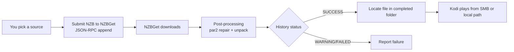

# NZBGet backend

By default, NZB-DAV downloads and streams through nzbdav. It can use
**NZBGet** as the backend instead. In that mode it submits the NZB to NZBGet
and waits for NZBGet to download and post-process it. It then plays the
finished file from an SMB share or a local/mounted path.

!!! info "Beta feature"
    The NZBGet backend was added in 2.0.0-beta.1 and is available on the
    [Beta channel](../getting-started/beta-channel.md). Stable 1.2.3 supports
    nzbdav only.

!!! warning "NZBGet mode replaces the streaming pipeline"
    In NZBGet mode, the nzbdav-specific features don't apply: live WebDAV
    streaming, the local stream proxy tiers, and mid-playback stream
    switching. NZBGet downloads and post-processes the whole file first. You
    then play it from the completed folder. Use this mode only if NZBGet is
    your download client.
    [Smart Duplicates failover](#smart-duplicates-failover) protects you
    against broken downloads instead.

## Enable and configure

These settings are in the **NZBGet Backend** group on the **NZBGet** tab:

| Setting | Default | What to enter |
|---------|---------|---------------|
| **Use NZBGet instead of nzbdav for playback** | Off | Turn on to switch to NZBGet mode. |
| **NZBGet URL** | `http://localhost:6789` | Your NZBGet address. |
| **NZBGet Username** | `nzbget` | NZBGet control username. |
| **NZBGet Password** | *(empty)* | NZBGet control password. |
| **NZBGet Category** | *(empty)* | The category to submit under. NZB-DAV also uses it to find the completed file when it can't read NZBGet's own `DestDir`. |
| **Completed Folder (SMB or Local Path)** | *(empty)* | NZBGet's completed-downloads base as Kodi sees it. This can be an SMB URL, for example `smb://server/downloads/completed`, or a local/mounted path such as an NFS mount, for example `/storage/downloads/completed`. |

Use **Test NZBGet Connection** to check the control API. Use **Test Completed
Folder** to check that Kodi can reach the completed folder. Playback fails with
"NZBGet not configured" if the URL or the completed folder is empty.

NZBGet mode also uses two settings from the **Polling** group on the
**Advanced** tab. **Poll interval (seconds)** sets how often NZB-DAV checks
NZBGet. **Download timeout (seconds)** defaults to 3600 and is clamped to
60–86400. If the timeout runs out, NZB-DAV reports "Download timed out" and
leaves the job running in NZBGet, so it can finish for a later play.

!!! info "Coming in the next beta"
    Local/mounted completed-folder paths are new on main after
    2.0.0-beta.2 and ship in the next beta build. Earlier builds accept
    `smb://` only.

<!--
Screenshot placeholder: capture the NZBGet settings tab with the backend
toggle, connection fields, and the two test actions.
To add: save it as docs-site/images/nzbget-settings.png, then replace this
comment with:  
-->

## How it works

- **Submission:** NZB-DAV fetches the NZB itself and uploads it through
  NZBGet's JSON-RPC `append` method with HTTP Basic auth.
- **Post-processing:** NZBGet handles this itself, with par2 repair and
  unpack. The progress dialog shows a "Post-processing..." stage while it
  runs.
- **Strict success:** a job counts as successful only when NZBGet reports a
  `SUCCESS` status. A `WARNING` result counts as a failure, so you're never
  handed a corrupt file. That includes repairable or damaged downloads where
  repair didn't complete.
- **File discovery:** NZB-DAV maps the job's completed directory onto your
  configured completed folder. It uses NZBGet's `DestDir` option when it can
  read it, and otherwise works it out from the category. It then scans up to
  three folder levels deep for a playable video: `.mkv`, `.mp4`, `.m4v`,
  `.avi`, `.ts`, `.m2ts` (new on main), `.wmv`, or `.mov`. It keeps retrying
  for up to 60 seconds while NZBGet's moved files become visible. For movies, the largest
  video wins. For episode requests, samples, trailers, featurettes, and other
  extras are excluded, and a file named for the exact requested season and
  episode wins over larger videos. If the right episode can't be identified,
  the selection fails rather than playing a different episode.
- **Readability check:** NZB-DAV hands the file to Kodi only after reading its
  first bytes through Kodi's own file layer. A file can still be settling after
  NZBGet's move, or Kodi's cached SMB session can deny access even though the
  file is listed. In those cases NZB-DAV keeps retrying. If the file never
  becomes readable, it shows a notification: "Video file is listed but not
  readable. If this persists, check the share or mount and restart Kodi."
  This check was added in 2.0.0-beta.2.

## Smart Duplicates failover

The NZBGet backend downloads the whole release before playback, so it can't
switch streams live. It relies on NZBGet's own
[Smart Duplicates](https://nzbget.com/documentation/rss/#duplicates) instead.
When you pick a release, NZB-DAV also submits every other result with the
**same release name**. These are reposts or mirrors of the same release from
other indexers. Every submission gets:

- a shared **duplicate key** for the release: the normalized release name,
  prefixed with a content ID when one is known (for example `imdb=<id>`,
  `themoviedb=<id>`, or `tvdbid=<id>-S<ss>-E<ee>`);
- its own **duplicate score**, with your pick scored highest and each backup
  scored strictly lower;
- **duplicate mode `SCORE`**.

NZBGet downloads the highest-scored item, which is your pick, so the progress
bar and completion behave exactly as before. It parks the rest in its history
as duplicate backups (status `dupe`) without downloading them. The score
decides which item plays, not the submission order. That keeps your pick
active and lets the backups go in at any time. They're submitted in a
background thread and never delay playback.

Your pick can finish unrepairable: par2 repair fails, unpack fails, or health
drops below NZBGet's critical threshold. NZBGet then automatically pulls the
highest-scored backup out of history and downloads it instead. It doesn't
combine recovery blocks across releases. It fails over to a whole alternate
copy and repairs that with its own par2. The add-on **follows this failover
live within the same play**. It tracks the promoted backup and plays it when
it completes, or plays a backup that already finished, instead of reporting a
failed playback. NZBGet may refuse your pick because the same content is
already in its history. If nothing else in the set can play, NZB-DAV
re-submits the pick once with `FORCE`.

If you cancel the play, NZB-DAV removes everything that play submitted or was
following: the pick, any promoted backup, and the parked backups. NZBGet
doesn't keep a backup running, and another play of the same release isn't
affected.

Besides exact same-name reposts, the backup pool also includes
same-content mirrors and NZBHydra's deferred duplicate uploads. These are
submitted as the lowest-priority backups.

!!! note "NZBGet options that affect failover"
    For automatic failover, NZBGet's **HealthCheck** option must be `Delete`,
    `None`, or `Park`. The modern default is `Delete`. With `Pause`, NZBGet
    pauses a broken download instead of promoting a backup. The add-on shows a
    notice about this once per Kodi session. If NZBGet's **DupeCheck** is `no`,
    NZB-DAV skips the backups entirely, because NZBGet would download them all
    in parallel.

The backups are best-effort. A backup that fails to submit never affects your
pick's download or playback. They're controlled by two fallback settings:

- **Enable fallback streams** turns the backups on or off.
- **Maximum standby fallback streams** caps how many are submitted. Unlike the
  nzbdav path, NZBGet mode has no built-in ceiling of 5.

## Reusing already-downloaded files

If NZBGet already downloaded a title successfully, the picker marks it with a
green **DL** tag. A result gets the tag when its name matches a `SUCCESS`
history item, its size is within 15%, and its recorded Usenet post date
matches. If you play it, NZB-DAV reuses the completed file directly instead of
resubmitting it. This is deliberate: NZBGet's duplicate check would otherwise
delete a resubmission of a `SUCCESS` item and fail the playback.

NZB-DAV also remembers completed folders that hold at least two reliably named
episodes from one season as season packs. When the exact episode you want is
in such a pack, later episode pickers show an
**Already downloaded season pack - Episodes …** row above the online releases.
Each record is tied to the `nzbget` backend, the exact NZBGet `NZBID`, and that
job's `DestDir`. Files from another job are never merged in just because its
name looks the same. When you select the row, NZB-DAV checks that exact
successful history item and completed folder again. It then plays the
requested episode without a new submission.

A record is removed when it goes stale: the job is confirmed missing, the
folder changed, or the folder is reachable but no longer holds the requested
episode. You then see "The downloaded season pack is no longer available.
Choose another result." Temporary NZBGet, share/mount, authentication, or
network errors fail that reuse attempt but keep the record. Either way, the
ordinary online results stay available.

!!! info "Beta feature"
    Exact season-pack episode reuse was added in 2.0.0-beta.2 and is available
    on the [Beta channel](../getting-started/beta-channel.md). It works the
    same way on the nzbdav backend.

## Resume and playback

NZBGet mode supports the same resume-or-restart prompt as the nzbdav path.
When you replay a release, you can choose **Resume from …** or **Start from
beginning**. The prompt follows Kodi's own default play action setting. The
background service saves your resume point when you stop playback.
