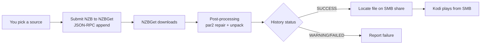

# NZBGet backend

By default, NZB-DAV downloads and streams through nzbdav. As an alternative, it
can use **NZBGet** as the backend: it submits the NZB to NZBGet, waits for
NZBGet to download and post-process it, and then plays the finished file from an
SMB share.

!!! warning "NZBGet mode replaces the streaming pipeline"
    In NZBGet mode, the nzbdav-specific features don't apply. There's no live
    WebDAV streaming, no local stream proxy tiers, and **no fallback streams**.
    NZBGet fully downloads and post-processes the file first, then you play it
    from the completed folder over SMB. Use this mode only if NZBGet is your
    download client.

## Enable and configure

On the **NZBGet** tab:

| Setting | Default | What to enter |
|---------|---------|---------------|
| **Use NZBGet instead of nzbdav for playback** | Off | Turn on to switch to NZBGet mode. |
| **NZBGet URL** | `http://localhost:6789` | Your NZBGet address. |
| **NZBGet Username** | `nzbget` | NZBGet control username. |
| **NZBGet Password** | *(empty)* | NZBGet control password. |
| **NZBGet Category** | *(empty)* | The category to submit under. NZBGet nests completed downloads in a category subfolder, and NZB-DAV uses this to find the file. |
| **SMB Completed Folder** | *(empty)* | The SMB URL of NZBGet's completed downloads base, for example `smb://server/downloads/completed`. |

Use **Test NZBGet Connection** to verify the control API, and **Test SMB Share**
to verify the completed folder is reachable.

> **📷 Screenshot needed** — Capture the **NZBGet** settings tab with the backend
> toggle, connection fields, and the two test actions. Save it to
> `docs-site/images/nzbget-settings.png` and replace this note with
> ``.

## How it works

- **Submission** uses NZBGet's JSON-RPC `append` method with HTTP Basic auth.
- **Post-processing** is NZBGet's own — par2 repair and unpack. The progress
  dialog shows a "Post-processing…" stage while this runs.
- **Success is strict.** A job counts as successful only when NZBGet reports a
  `SUCCESS` status. A `WARNING` result (including repairable or damaged
  downloads where repair didn't complete) is treated as failure, so you're never
  handed a corrupt file.
- **File discovery** maps NZBGet's completed directory onto your SMB share,
  accounting for the category subfolder, then scans for a playable video.

## Reusing already-downloaded files

If you play a title that NZBGet already downloaded successfully, NZB-DAV reuses
the completed file directly instead of resubmitting it. This is deliberate:
NZBGet's duplicate check would otherwise delete a resubmission of a `SUCCESS`
item and fail the playback.

## Resume and playback

NZBGet mode supports the same **Resume from…** prompt as the nzbdav path, and
the background service persists your resume point as you watch.
