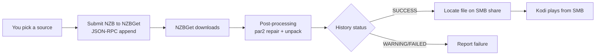

# NZBGet backend

By default, NZB-DAV downloads and streams through nzbdav. As an alternative, it
can use **NZBGet** as the backend: it submits the NZB to NZBGet, waits for
NZBGet to download and post-process it, and then plays the finished file from an
SMB share.

!!! warning "NZBGet mode replaces the streaming pipeline"
    In NZBGet mode, the nzbdav-specific features don't apply. There's no live
    WebDAV streaming, no local stream proxy tiers, and no mid-playback stream
    switching. NZBGet fully downloads and post-processes the file first, then
    you play it from the completed folder over SMB. Use this mode only if
    NZBGet is your download client. Broken-download protection is provided by
    [Smart Duplicates failover](#smart-duplicates-failover) instead.

## Enable and configure

On the **NZBGet** tab:

| Setting | Default | What to enter |
|---------|---------|---------------|
| **Use NZBGet instead of nzbdav for playback** | Off | Turn on to switch to NZBGet mode. |
| **NZBGet URL** | `http://localhost:6789` | Your NZBGet address. |
| **NZBGet Username** | `nzbget` | NZBGet control username. |
| **NZBGet Password** | *(empty)* | NZBGet control password. |
| **NZBGet Category** | *(empty)* | The category to submit under. NZBGet nests completed downloads in a category subfolder, and NZB-DAV uses this to find the file. |
| **SMB Completed Folder** | *(empty)* | The SMB URL of NZBGet's completed downloads base, for example `smb://server/downloads/completed`. |

Use **Test NZBGet Connection** to verify the control API, and **Test SMB Share**
to verify the completed folder is reachable.

<!--
Screenshot placeholder — Capture the NZBGet settings tab with the backend
toggle, connection fields, and the two test actions.
To add: save it as docs-site/images/nzbget-settings.png, then replace this
comment with:  
-->

## How it works

- **Submission** uses NZBGet's JSON-RPC `append` method with HTTP Basic auth.
- **Post-processing** is NZBGet's own — par2 repair and unpack. The progress
  dialog shows a "Post-processing…" stage while this runs.
- **Success is strict.** A job counts as successful only when NZBGet reports a
  `SUCCESS` status. A `WARNING` result (including repairable or damaged
  downloads where repair didn't complete) is treated as failure, so you're never
  handed a corrupt file.
- **File discovery** maps NZBGet's completed directory onto your SMB share,
  accounting for the category subfolder, then scans for a playable video.

## Smart Duplicates failover

The NZBGet backend downloads the whole release before playback, so it can't do
live stream cutover. Instead it uses NZBGet's own
[Smart Duplicates](https://nzbget.com/documentation/rss/#duplicates). When you
pick a release, the picker also submits every other result that shares the
**same release name** (reposts / mirrors of the same release from other
indexers), all with:

- a shared **duplicate key** identifying the release — a canonical `imdb=<id>` /
  `tvdbid=<id>-S<ss>-E<ee>` when the id is known, otherwise a title-based
  fallback;
- a per-item **duplicate score**, with your pick scored highest and each backup
  strictly lower;
- **duplicate mode `SCORE`**.

NZBGet then downloads the highest-scored item — your pick, so the progress bar
and completion behave exactly as before — and parks the rest in its history as
duplicate backups (status `dupe`) without downloading them. Because the pick is
chosen by score rather than by submission order, it reliably stays the one that
plays, and the backups can be submitted at any time (in a background thread, so
they never delay playback).

If the pick finishes unrepairable (par2 repair fails, unpack fails, or health
drops below NZBGet's critical threshold), NZBGet automatically pulls the
highest-scored backup out of history and downloads it instead. NZBGet does not
combine recovery blocks across releases; it fails over to a whole alternate
copy and repairs that with its own par2. The add-on **follows this failover
live within the same play**: it tracks the promoted backup (a new download
under the same duplicate set) and plays it when it completes — or plays a
backup that already finished — instead of reporting a failed playback.
Canceling the play removes everything this play submitted or was following
(the pick, any promoted backup, and the parked backups), so NZBGet doesn't
keep a backup running -- while another play of the same release stays
untouched. Beyond the exact same-name reposts, the backup pool also
includes same-content mirrors and NZBHydra's deferred duplicate uploads as
lowest-priority backups.

!!! note "HealthCheck must allow failover"
    Automatic failover requires NZBGet's **HealthCheck** option to be `Delete`,
    `None`, or `Park` (the modern default is `Delete`). If it is set to `Pause`,
    NZBGet pauses a broken download instead of promoting a backup; the add-on
    shows a one-time notice if it detects this.

The backups are capped by **Maximum standby fallback streams**, gated by
**Enable fallback streams**, and best-effort — a backup that fails to submit
never affects the pick's download or playback.

## Reusing already-downloaded files

If you play a title that NZBGet already downloaded successfully, NZB-DAV reuses
the completed file directly instead of resubmitting it. This is deliberate:
NZBGet's duplicate check would otherwise delete a resubmission of a `SUCCESS`
item and fail the playback.

## Resume and playback

NZBGet mode supports the same **Resume from…** prompt as the nzbdav path, and
the background service persists your resume point as you watch.
