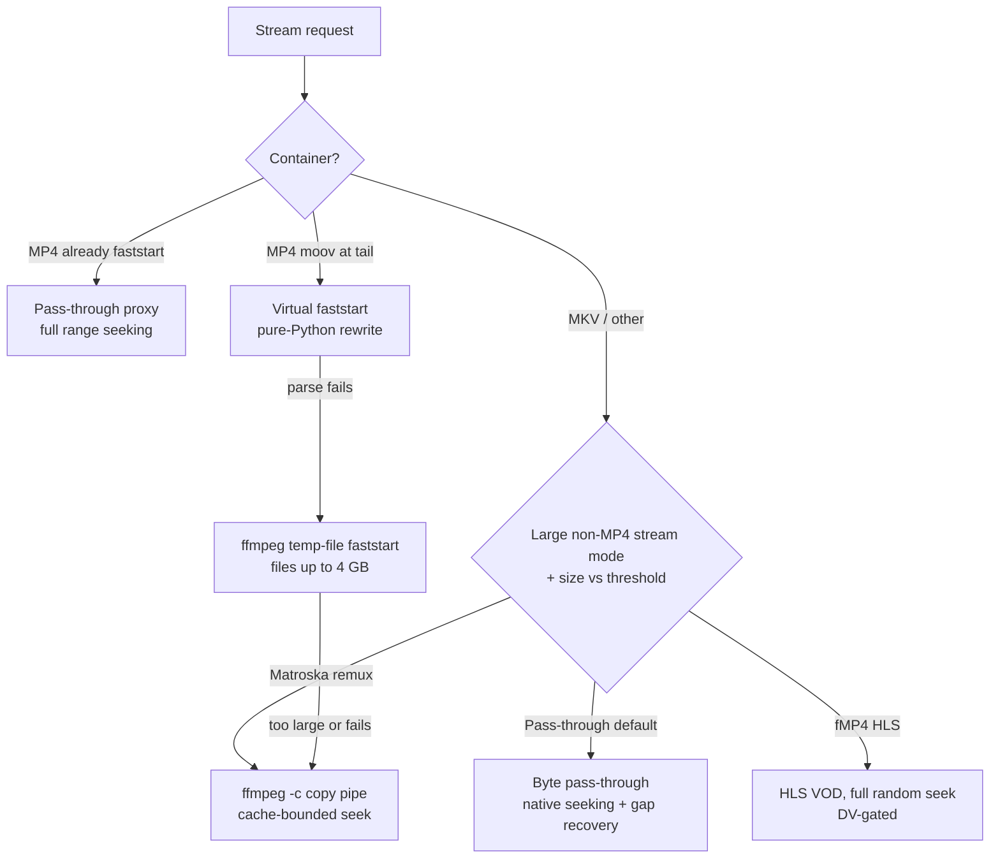

# Playback, remux, and seeking

On the nzbdav backend, every playback request goes through a local HTTP proxy
that NZB-DAV runs as a background service. Kodi talks only to this proxy on
`127.0.0.1`, never directly to your WebDAV server. (The
[NZBGet backend](nzbget-backend.md) plays finished files straight from the
completed folder instead.) This design avoids a Kodi bug where scanning the parent
directory over WebDAV throws an `Open - Unhandled exception`, and it lets
NZB-DAV add seeking, format handling, and recovery on top of the raw stream.

## What the proxy does for you

- **Preserves seeking** through HTTP range requests.
- **Fixes tail-`moov` MP4s** so they start right away instead of needing the
  whole file first. A pure-Python rewriter moves the `moov` to the front
  virtually and rewrites the `stco`/`co64` chunk offsets. No ffmpeg is needed.
- **Recovers from missing articles** mid-stream by probing forward and filling
  the gap, so a few bad blocks don't kill playback.
- **Offers optional remux tiers** for very large or awkward files.
- **Enables mid-playback source switching** via [fallback streams](fallback-streams.md).

## How a file is served

NZB-DAV picks a serving path based on the container, the file size, and your
settings:

- **MP4, already faststart:** proxied as-is with full range seeking.
- **MP4 with `moov` at the tail:** rewritten in pure Python into a virtual
  faststart file so it plays immediately. If parsing fails, NZB-DAV tries an
  ffmpeg temp-file faststart (files up to 4 GB only), then an ffmpeg Matroska
  remux. If ffmpeg isn't available either, it falls back to a plain proxy.
- **MKV and other containers** (including `.ts`/`.m2ts`): by default, streamed
  as a byte pass-through with native seeking and gap recovery.

!!! note "Fallback streams force pass-through"
    If verified [fallback backups](fallback-streams.md) are already attached
    when a stream starts, NZB-DAV serves it as a plain byte pass-through and
    skips the MP4 rewrite and the remux tiers. Mid-stream switching needs the
    original byte offsets. It only works on the pass-through path.

## Settings that control playback

These are in the **Proxy** group on the **Advanced** tab. The defaults are safe,
so only change them if you have a specific reason.

| Setting | Default | What it does |
|---------|---------|--------------|
| **Large non-MP4 stream mode** | Direct pass-through (default) | Chooses how large non-MP4 files are served: **Direct pass-through** (no ffmpeg), **fMP4 HLS (compatibility, experimental)** (full random seek), or **Matroska remux (compatibility)**. |
| **Force ffmpeg remux above (MB, 0=off)** | 15000 (~15 GB) | The size where the selected remux mode takes over for non-MP4 files. `0` turns the size-based remux off, so those files always stream pass-through. It has no effect while the mode is Direct pass-through. |
| **Convert MP4 subtitles to SRT** | On | During a Matroska remux, converts subtitles from non-MKV sources (MP4 `mov_text`) to SRT so embedded subs survive. MKV subtitle tracks are copied unchanged. |

With a remux mode selected, NZB-DAV also remuxes any non-MP4 file whose size
it can't determine. That's safer than serving an unsized pass-through.

!!! note "Pass-through is the default for a reason"
    On 32-bit devices such as many CoreELEC boxes, direct pass-through gives the
    best compatibility. The remux tiers are for specific hard cases, such as very
    large Dolby Vision or lossless-audio remuxes, and they need ffmpeg. ffmpeg
    stays optional:

    - If no ffmpeg is found, a file over the threshold falls back to
      pass-through, and the log warns that it may fail on 32-bit Kodi.
    - If your ffmpeg lacks the fMP4 HLS muxer flags, or the source's duration
      can't be probed, fMP4 HLS falls back to Matroska remux.
    - If the HLS ffmpeg process fails to produce output at startup, the session
      switches to Matroska remux too.

    NZB-DAV looks for ffmpeg on `PATH`, in the **ffmpeg-tools** add-on
    (`tools.ffmpeg-tools`), `/usr/bin/ffmpeg`, and `/storage/.opt/bin/ffmpeg`.

### Full seeking on large files

NZB-DAV's design notes say that some 32-bit Kodi builds (common on
CoreELEC/Amlogic devices) fail on pass-through streams larger than about 4 GB
unless Kodi's in-memory cache is disabled with
`<cache><memorysize>0</memorysize></cache>` in `advancedsettings.xml`. NZB-DAV
doesn't test for this and doesn't act on it. It never writes
`advancedsettings.xml`, and the **Large non-MP4 stream mode** setting alone
decides between pass-through and remux. The only use of the file is a read-only
check that controls an advisory dialog. When a stream you started from
TMDBHelper is served through an ffmpeg remux and the cache isn't already `0`,
NZB-DAV shows the dialog at most once per Kodi session (unless you choose
**Never ask**). See
[advancedsettings.xml and seeking](../reference/advancedsettings.md).

## Dolby Vision handling

When you choose the fMP4 HLS mode, NZB-DAV reads the Dolby Vision RPU from the
source in pure Python and routes each file based on the result. Not every DV
variant is safe over HLS on Amlogic devices:

| Source | Route |
|--------|-------|
| Dolby Vision Profile 7 FEL (dual-layer) | Matroska remux (HLS can't carry it) |
| Dolby Vision Profile 7 MEL | fMP4 HLS (metadata-only, experimental) |
| Dolby Vision Profile 5 / 8 / other | Matroska remux (safest on Amlogic) |
| Non-DV | fMP4 HLS |
| Unknown | Matroska remux (fail-safe) |

This probe runs only on the fMP4 HLS path. Pass-through and Matroska remux
serve Dolby Vision sources unchanged.

## Resilience knobs

The **Pass-through validation** group on the **Advanced** tab controls how the
pass-through path recovers:

| Setting | Default |
|---------|---------|
| **Strict upstream contract mode** | Warn only |
| **Enable density breaker** | Off |
| **Enable zero-fill budget** | On |
| **Enable retry ladder before skip probe** | On |
| **Max seconds to wait for a slow/stalled backend before giving up (0=off)** | 120 (clamped 0–600) |
| **Read-ahead buffer size in MB (keeps filling while paused; 0=off)** | 256 (clamped 0–4096) |
| **Send 200 for no-range pass-through** | Off |

When a stream stops because the backend fell behind, NZB-DAV shows a
"nzbdav can't keep up — playback stalled" notification instead of leaving you
at a silent black screen.

!!! info "Beta feature"
    The stall-wait budget, the read-ahead buffer, and the stall notification
    were added in 2.0.0-beta.1. They're available on the
    [Beta channel](../getting-started/beta-channel.md).

Each setting is documented in the
[Settings reference](../reference/settings.md#pass-through-validation) and
explained in [How it works → Stream proxy](../how-it-works/stream-proxy.md).
