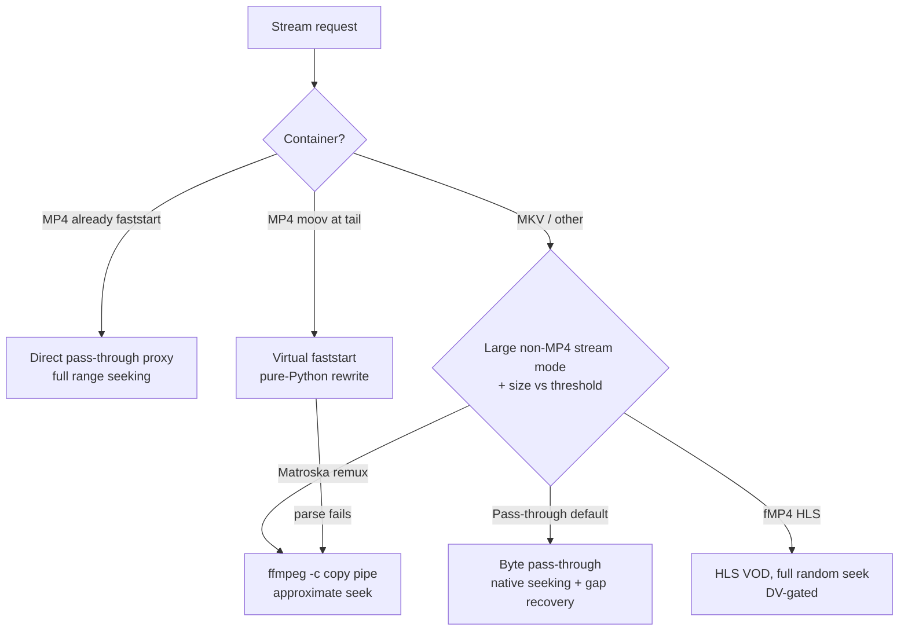

# Playback, remux, and seeking

Every playback request goes through a local HTTP proxy that NZB-DAV runs as a
background service. Kodi talks only to this proxy on `127.0.0.1`, never directly
to your WebDAV server. This design avoids a Kodi bug where scanning the parent
directory over WebDAV throws an `Open - Unhandled exception`, and it lets
NZB-DAV add seeking, format handling, and recovery on top of the raw stream.

## What the proxy does for you

- **Preserves seeking** through HTTP range requests.
- **Fixes tail-`moov` MP4s** so 4 GB+ MP4 remuxes play on 32-bit Kodi, using a
  pure-Python rewriter (no ffmpeg needed).
- **Recovers from missing articles** mid-stream by probing forward and filling
  the gap, so a few bad blocks don't kill playback.
- **Offers optional remux tiers** for very large or awkward files.
- **Enables mid-playback source switching** via [fallback streams](fallback-streams.md).

## How a file is served

NZB-DAV picks a serving path based on the container, the file size, and your
settings:

- **MP4, already faststart** — proxied directly with full range seeking.
- **MP4 with `moov` at the tail** — rewritten in pure Python into a virtual
  faststart file so it plays immediately; if parsing fails, it falls back to an
  ffmpeg remux.
- **MKV and other containers** — by default, streamed as a byte pass-through
  with native seeking and gap recovery.

## Settings that control playback

These live on the **Advanced** tab. Defaults are safe; change them only with a
reason.

| Setting | Default | What it does |
|---------|---------|--------------|
| **Large non-MP4 stream mode** | Direct pass-through | Chooses how large non-MP4 files are served: **Direct pass-through** (default, no ffmpeg), **fMP4 HLS** (experimental, full random seek), or **Matroska remux** (compatibility). |
| **Force ffmpeg remux above (MB)** | 15000 (~15 GB) | The size at which the two remux modes kick in. `0` disables remux entirely, so everything streams pass-through regardless of size. |
| **Convert MP4 subtitles to SRT** | On | Converts MP4 `mov_text` subtitles to SRT during remux so embedded subs survive. |

!!! note "Pass-through is the default for a reason"
    On 32-bit devices such as many CoreELEC boxes, direct pass-through gives the
    best compatibility. The remux tiers exist for specific hard cases (very
    large Dolby Vision or lossless-audio remuxes) and require ffmpeg. If ffmpeg
    isn't installed, NZB-DAV automatically falls back to pass-through.

### Full seeking on large files

Direct pass-through supports full seeking only if Kodi's in-memory cache is
turned off. Setting `<cache><memorysize>0</memorysize></cache>` in
`advancedsettings.xml` enables this; without it, large files fall back to a
remux mode where seeking is bounded. NZB-DAV prompts you about this the first
time it matters. See [advancedsettings.xml and seeking](../reference/advancedsettings.md).

## Dolby Vision handling

When you enable the fMP4 HLS mode, NZB-DAV probes each source for its Dolby
Vision profile and routes accordingly, because not every DV variant is safe over
HLS on Amlogic devices:

| Source | Route |
|--------|-------|
| Dolby Vision Profile 7 FEL (dual-layer) | Matroska remux (HLS can't carry it) |
| Dolby Vision Profile 7 MEL | fMP4 HLS (metadata-only, experimental) |
| Dolby Vision Profile 5 / 8 / other | Matroska remux (safest on Amlogic) |
| Non-DV | fMP4 HLS |
| Unknown | Matroska remux (fail-safe) |

## Resilience knobs

The **Advanced** tab also exposes recovery controls — a strict upstream contract
mode, a density breaker, a zero-fill budget, a retry ladder, a stall-wait
budget, and a read-ahead buffer. Each is documented in the
[Settings reference](../reference/settings.md#advanced) and explained in
[How it works → Stream proxy](../how-it-works/stream-proxy.md).
