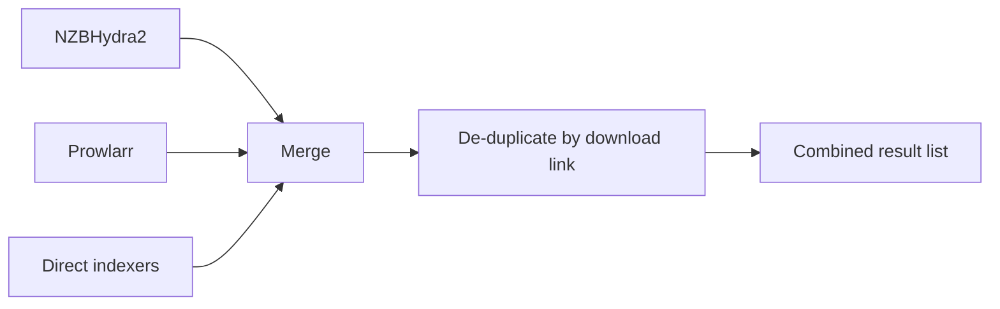

# Search and indexers

When you play a title, NZB-DAV searches every enabled provider, merges the
results, removes duplicates, and hands the combined list to the
[filtering and ranking](quality-filtering.md) stage.

## Provider types

You can enable any combination of three provider types. If none is enabled,
NZB-DAV tells you so instead of searching.

### NZBHydra2

NZB-DAV queries NZBHydra2's Newznab XML API. For episodes it prefers a TVDB id
(then an IMDb id) so results are accurate; for movies it uses the IMDb id. If an
id-based query returns nothing, NZB-DAV automatically retries by cleaned title
so a missing or mismatched id doesn't leave you with zero results.

### Prowlarr

NZB-DAV queries Prowlarr's native search API, which returns JSON. Because
Prowlarr's native search binds ids inside the query text rather than as separate
parameters, NZB-DAV embeds them as tokens — `{tvdbid:…}`, `{imdbid:…}`,
`{season:…}`, `{episode:…}` — alongside the cleaned title.

!!! info "Prowlarr contributes Usenet results only"
    NZB-DAV keeps only releases whose protocol is **usenet**. Torrent results
    from Prowlarr are silently dropped. A torrent-only indexer in your Prowlarr
    indexer list contributes nothing.

Set **Prowlarr Indexer IDs** to a comma-separated list to query specific
indexers. Prowlarr returns no results if this list is empty, so specify at least one indexer ID.

### Direct Newznab indexers

If you don't run Hydra or Prowlarr, connect directly to individual Newznab
indexers. NZB-DAV queries them in parallel and includes each indexer's caps
(advertised search capabilities) when building queries.

Two ways to configure them, both on the **Indexers** tab:

- **Popular indexers** — built-in rows for NZB.su/NZB.life, NZBGeek, NZBFinder,
  NZBPlanet, DrunkenSlug, and DOGnzb. Enable one, enter its API key, done.
- **Manage Indexers** — a dialog for adding any Newznab indexer from a larger
  preset catalog (23 well-known indexers) or a fully custom URL, and for
  testing, editing, enabling/disabling, and deleting them.

The **Manage Indexers** dialog validates each URL, re-fetches caps when you
change a connection, and warns you before you disable your last enabled indexer.

<!--
Screenshot placeholder — Capture the Manage Indexers dialog showing the
top-level list (Add Newznab Indexer, Refresh NZBHydra2 Caps, and per-indexer
entries).
To add: save it as docs-site/images/manage-indexers.png, then replace this
comment with:  
-->

## How results are combined

- Each provider normalizes its results into a common shape: title, download
  link, size, indexer name, post date, and age.
- **De-duplication is by download link.** The first occurrence of a link wins.
  A release that two providers return with *different* download URLs appears
  twice — this is intentional, because those are genuinely different downloads.
- A result with no download link is dropped, because it can't be played.

## Search caching

Searches are cached so that re-opening the same title is instant. The cache
duration is the **Cache duration** setting (default 300 seconds; set to `0` to
disable). The cache stores the raw, pre-filter results, so changing your filter
or sort settings takes effect immediately without a new search. Clear it any
time from the add-on's main menu (**Clear Cache**).

For the internal mechanics — the query planner, caps handling, and the exact
result fields — see [How it works → Search pipeline](../how-it-works/search-pipeline.md).
