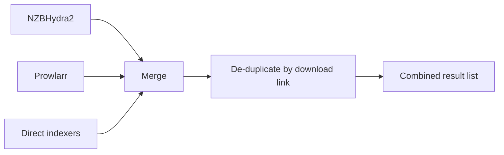

# Search and indexers

When you play a title, NZB-DAV searches every enabled provider, merges the
results, removes duplicates, and hands the combined list to the
[filtering and ranking](quality-filtering.md) stage.

## Provider types

You can enable any combination of three provider types. If none is enabled,
NZB-DAV tells you so instead of searching.

!!! tip "Recommended: use NZBHydra2"
    Rather than adding every indexer's Newznab API key on NZB-DAV's
    **Indexers** tab, run [NZBHydra2](https://github.com/theotherp/nzbhydra2)
    and point NZB-DAV at it. Hydra gives you a much better interface for
    managing indexers and searches, and it's highly configurable: per-indexer
    limits, categories, and priorities, all in one place. You don't lose
    anything by going through it. NZB-DAV still shows which indexer each result
    came from, in the results list's **Indexer** column. On NZBHydra2,
    [fallback streams](fallback-streams.md) can also find same-release uploads
    that Hydra merged into a single result.

### NZBHydra2

NZB-DAV queries NZBHydra2's Newznab XML API and shapes each query to the
search capabilities (caps) Hydra advertises. It fetches those caps on first
search and caches them. After changing Hydra's URL or its indexers, refresh
them from **Manage Indexers → Refresh NZBHydra2 Caps** on the **Indexers** tab
(the button is greyed out until **Enable direct Newznab indexers** is on);
until then a changed URL is searched with a default query shape. For episodes it prefers a TVDB id (then
an IMDb id) so results are accurate; for movies it uses the IMDb id. If the
first query returns nothing, NZB-DAV automatically retries with a plain title
search, so a missing or mismatched id doesn't leave you with zero results.

### Prowlarr

NZB-DAV queries Prowlarr's native search API, which returns JSON. Because
Prowlarr's native search binds ids inside the query text rather than as separate
parameters, NZB-DAV embeds them as tokens — `{tvdbid:…}`, `{imdbid:…}`,
`{season:…}`, `{episode:…}` — alongside the cleaned title. For episodes the
TVDB id is preferred over the IMDb id. If an id-keyed query returns nothing,
NZB-DAV retries by title, keeping the season and episode tokens.

!!! info "Prowlarr contributes Usenet results only"
    NZB-DAV keeps only releases whose protocol is **usenet**. Torrent results
    from Prowlarr are silently dropped. A torrent-only indexer in your Prowlarr
    indexer list contributes nothing.

Set **Prowlarr Indexer IDs** to a comma-separated list to query specific
indexers. Prowlarr returns no results if this list is empty, so specify at least one indexer ID.

### Direct Newznab indexers

If you don't run Hydra or Prowlarr, connect directly to individual Newznab
indexers. NZB-DAV queries them in parallel (up to four at a time, 15 seconds
per request, 20 seconds for the whole batch) and shapes each query to that
indexer's caps when it has them. An indexer that times out or fails is
skipped; the others still return results.

Two ways to configure them, both on the **Indexers** tab:

- **Popular indexers** — built-in rows for NZB.su/NZB.life, NZBGeek, NZBFinder,
  NZBPlanet, DrunkenSlug, and DOGnzb. Enable one, enter its API key, done.
- **Manage Indexers** — a dialog for adding any Newznab indexer from a larger
  preset catalog (22 well-known indexers) or a fully custom URL, and for
  testing, editing, enabling/disabling, and deleting them.

The **Manage Indexers** dialog fetches caps before it saves a new indexer,
validates each URL, re-fetches caps when you change a connection, and asks for
confirmation before you delete your last enabled indexer. The first time you
open it, it copies any complete rows from the **Indexers** tab into its list;
from then on the managed entry wins over the tab row with the same id.
**Test Direct Indexers** checks caps for every enabled indexer.

!!! info "Beta feature"
    **Manage Indexers** was added in 2.0.0-beta.1 and is available on the
    [Beta channel](../getting-started/beta-channel.md).

<!--
Screenshot placeholder — Capture the Manage Indexers dialog showing the
top-level list (Add Newznab Indexer, Refresh NZBHydra2 Caps, and per-indexer
entries).
To add: save it as docs-site/images/manage-indexers.png, then replace this
comment with:  
-->

## TV and movie ids

Id-keyed searches are far more accurate than title searches. TMDBHelper
normally passes the ids NZB-DAV needs, and they are used directly. When one is
missing and you've set **TMDB API key (optional, movies and TV)** on the
**Connection** tab:

- **Episodes** — NZB-DAV looks up the show's TVDB id from its TMDB or IMDb id,
  because many indexers key TV on TVDB ids. All providers share the one lookup.
- **Movies** — when only a TMDB id is available, NZB-DAV converts it to the
  movie's IMDb id.

Successful lookups are cached on disk. Without a key, or if a lookup fails,
the search simply uses the ids and title it already has.

!!! info "Beta feature"
    TVDB lookup for episodes was added in 2.0.0-beta.1 and is available on the
    [Beta channel](../getting-started/beta-channel.md).

## How results are combined

- When more than one provider is enabled, they are searched at the same time.
  A provider that fails is logged and skipped; you only see its error if
  every provider failed and nothing came back.
- Each provider is asked for up to **Max results** (on the **Sorting** tab)
  results.
- Each provider normalizes its results into a common shape: title, download
  link, size, indexer name, post date, and age.
- **De-duplication is by download link.** The first occurrence of a link wins.
  A release that two providers return with *different* download URLs appears
  twice — this is intentional, because those are genuinely different downloads.
- A result with no download link is dropped, because it can't be played.

## Search caching

Searches are cached so that re-opening the same title is instant. The cache
duration is the **Cache duration** setting on the **Advanced** tab (default 60
seconds; set to `0` to disable). Only successful, non-empty searches are
cached. The cache stores the raw, pre-filter results, so changing your filter
or sort settings takes effect immediately without a new search. Clear it any
time from the add-on's main menu (**Clear Cache**).

The cache applies to NZB-DAV's own plugin search and play routes. The
TMDBHelper player always runs a fresh search.

For the internal mechanics — the query planner, caps handling, and the exact
result fields — see [How it works → Search pipeline](../how-it-works/search-pipeline.md).
