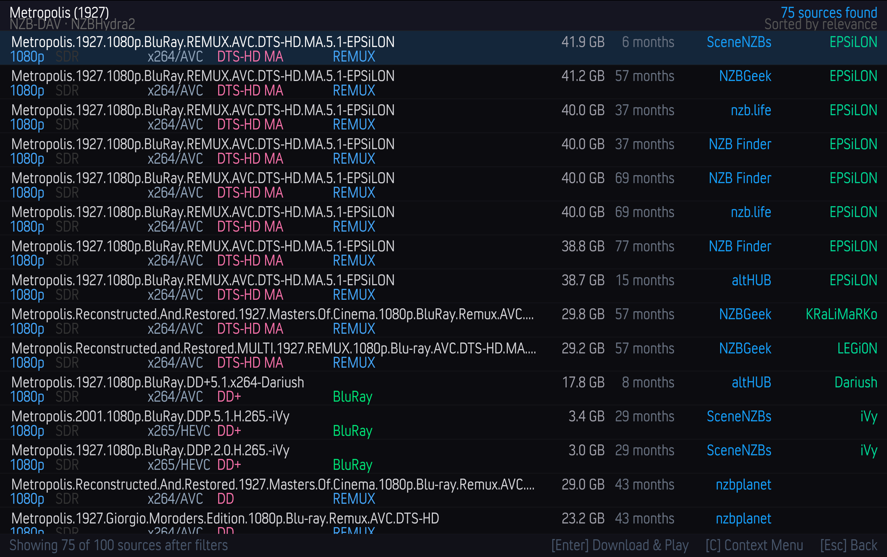

# Play your first title

With the connections configured and TMDBHelper set up, you're ready to stream.

## Start playback

1. Open **TMDBHelper** and browse to a movie or TV episode.
2. Start playback (or choose **Play with NZB-DAV** if prompted for a player).
3. NZB-DAV searches your providers and shows the **source picker**.

## Choose a source

The picker is a full-screen list of every release that passed your filters,
ranked by your chosen sort order. Each row shows the release name, resolution,
HDR format, video codec, audio format, source type, container, file size, age,
indexer, and release group.

- A green **DL** tag marks a release that's already downloaded on your backend,
  so it can play almost immediately.
- The status bar shows how many sources passed your filters.
- Select a row to download and play it. Press ++c++ for a context menu, or
  ++esc++ to go back.

If you turn on **Auto-select best match** in settings, NZB-DAV skips the picker
and plays the top-ranked result automatically.

## Watch the download progress

After you pick a source, NZB-DAV submits it to your backend and shows a progress
dialog that reflects the real download state:

| Stage | What it means |
|-------|---------------|
| Submitting NZB… | The NZB is being sent to nzbdav. |
| Queued… | Accepted, waiting to start. |
| Fetching NZB… | nzbdav is retrieving and parsing the NZB. |
| Waiting for propagation… | Waiting for article availability. |
| Downloading… *n*% | Actively downloading. |
| Paused | The backend paused the job. |

Playback starts automatically as soon as enough of the file is ready. If the
release turns out to be a placeholder or has missing article bodies, NZB-DAV
detects it and moves on rather than playing a broken file.

<!--
Screenshot placeholder — Capture the download progress dialog mid-download (for
example, showing "Downloading... 42%").
To add: save it as docs-site/images/progress-dialog.png, then replace this
comment with:  
-->

## Resume where you left off

If you've watched part of a title before, NZB-DAV offers Kodi's native
**Resume from…** / **Start from beginning** prompt when you replay it. Resume
points are tracked per release, so they survive even though the underlying
stream URL changes each session.

## One-time seeking setup for large files

The first time NZB-DAV needs the remux tier for a large file, it may show a
dialog about `advancedsettings.xml`. Setting Kodi's cache memory size to `0`
lets large files stream in direct pass-through mode with full seeking. This is
optional but recommended on low-memory or 32-bit devices. See
[advancedsettings.xml and seeking](../reference/advancedsettings.md) for the
exact steps.

## What happens behind the scenes

If you're curious how a pick becomes a playing stream — search, submission,
polling, the local proxy, and mid-playback recovery — read
[How it works](../how-it-works/architecture.md).

## Something didn't work?

See [Troubleshooting](../operations/troubleshooting.md) for the most common
setup, search, WebDAV, and playback issues.
