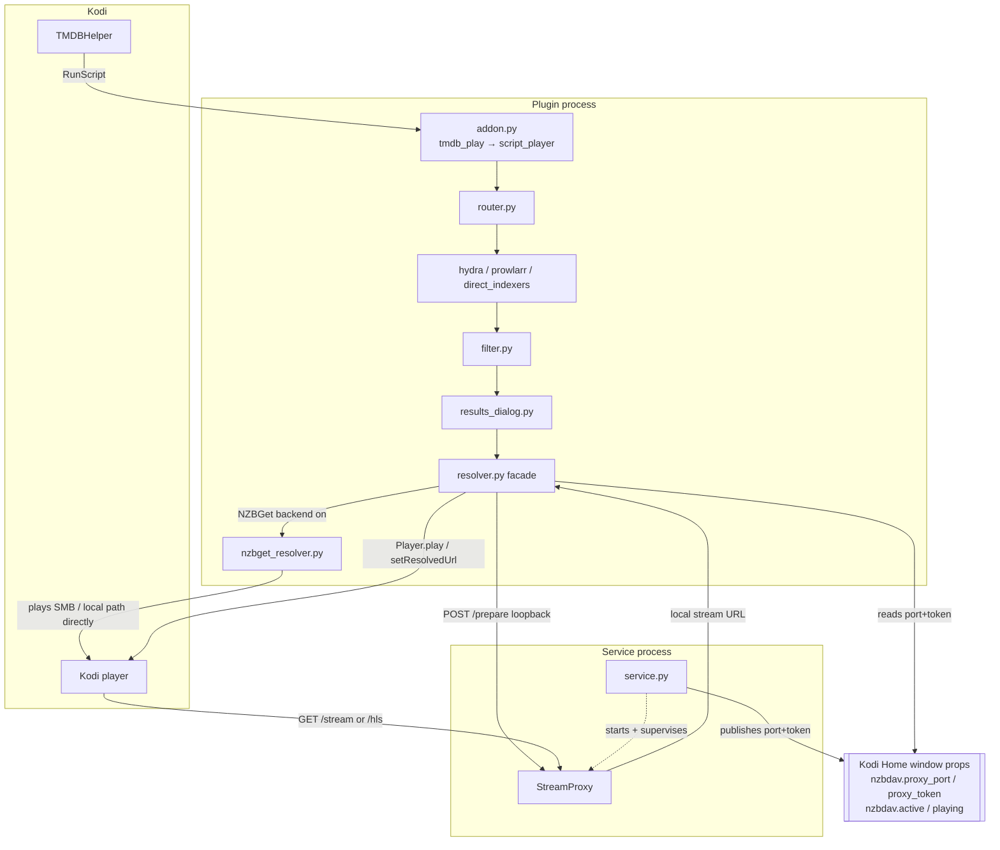
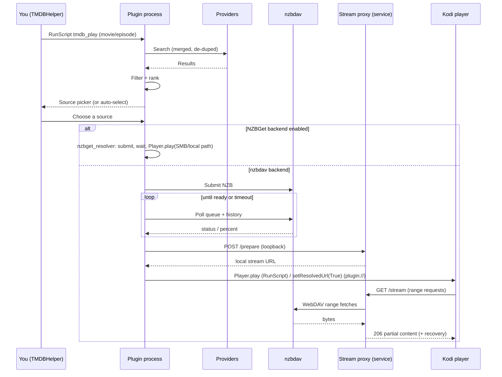
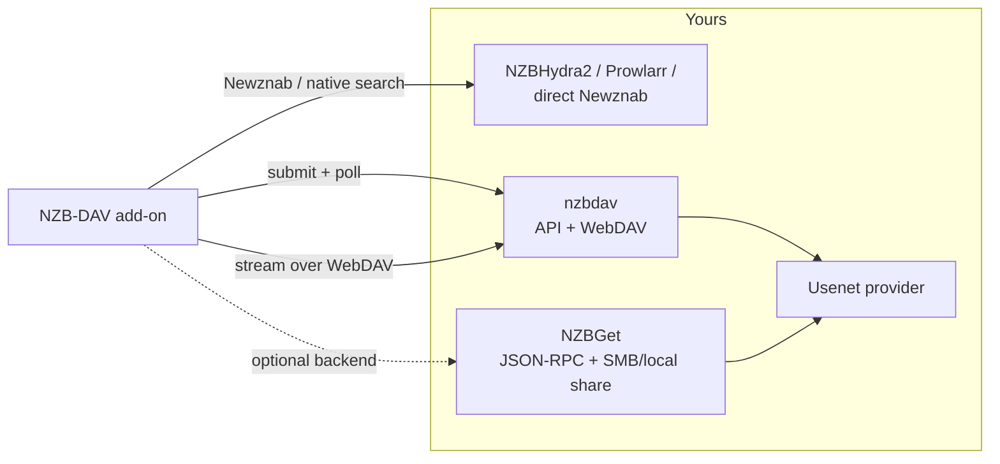

# Architecture

NZB-DAV is a Kodi 21 **player/resolver** add-on. It presents itself to
TMDBHelper as a player, and when you start a title it runs the whole pipeline:
search → filter → submit → poll → proxy → play. This page is the technical map;
the pages that follow drill into each stage.

!!! note "Runtime constraints that shape the design"
    The add-on runtime is **pure Python, 3.8-compatible, with no compiled
    dependencies** — so it runs identically on ARM64 CoreELEC boxes and x86-64
    desktops. Every third-party library (including the release-title parser) is
    vendored. These constraints explain several choices below, such as the
    pure-Python MP4 rewriter and the "no pip installs" rule.

## Two execution contexts

NZB-DAV runs in two separate processes, and understanding the split explains
most of the design.

- **The plugin process** is spawned each time you trigger an action (play,
  search, resolve, a settings test). It does the search, filtering, submission,
  and polling, then hands Kodi a local URL to play. The TMDBHelper player file
  (`resources/players/nzbdav.json`) invokes it with
  `RunScript(…/addon.py,tmdb_play,…)`; `addon.py` routes that to
  `script_player.run_tmdb_play()` → `router._handle_script_play()`. This path has
  no plugin handle, so playback starts with `xbmc.Player().play(...)` via
  `resolve_and_play()`. The handle-based `plugin://…/play` and `/direct_play`
  routes (dispatched by `router.route()`) finish with `setResolvedUrl` instead.
- **The service process** starts with Kodi (`start="startup"`) and runs for
  Kodi's whole lifetime. It owns the **stream proxy** — a localhost HTTP server
  on a random port. The plugin process reaches it by reading the port and a
  security token from Kodi's Home-window properties and POSTing to a loopback
  `/prepare` endpoint. The service also runs the playback monitor: the resolver
  sets `nzbdav.active` / `nzbdav.stream_url` before playback, and the service
  raises `nzbdav.playing` while it is monitoring the stream.

This is why, on the nzbdav backend, Kodi always plays from `127.0.0.1` and never
from your WebDAV server directly. With the [NZBGet backend](../features/nzbget-backend.md)
enabled, the resolver hands off to `nzbget_resolver.py` instead, which plays the
finished file straight from its SMB or local/mounted path. The proxy is not
involved.

## Module organization

Three large surfaces — `router.py`, `resolver.py`, and `stream_proxy.py` — are
**façades**. Their logic lives in many sibling modules (`router_*`, `resolver_*`,
`stream_proxy_*`) that are re-imported into the façade. This keeps each file
small while letting the test suite import and patch names from the façade. The
stream proxy in particular spans 34 `stream_proxy*` modules: `StreamProxy` is
composed from seven `stream_proxy_mgr_*` mixins and the `_StreamHandler`
request handler from thirteen `stream_proxy_handler_*` mixins.

| Area | Entry point | Key modules |
|------|-------------|-------------|
| Routing | `addon.py`, `router.py` | `script_player`, `router_scriptplay`, `router_play`, `router_search`, `router_dispatch` |
| Search | `hydra.py`, `prowlarr.py`, `direct_indexers.py` | `search_planner`, `newznab_caps`, `tvdb_resolver`, `indexer_manager` |
| Filtering | `filter.py` | `filter_normalize`, `filter_options`, `filter_remux`, `filter_groups`, `filter_fallback` |
| Results picker | `results_dialog.py` | `results_input` |
| Resolve/poll | `resolver.py` | `resolver_entry`, `resolver_flow`, `resolver_submit`, `resolver_poll`, `resolver_pollloop` |
| Backends | `nzbdav_api.py`, `nzbget_resolver.py` | `nzbdav_api_parsing`, `nzbget_api`, `nzbget_resolver_smb`, `nzbget_resolver_dupes` |
| WebDAV | `webdav.py` | `webdav_discovery`, `webdav_match` |
| Season packs | `season_pack.py` | `season_pack_recording`, `season_pack_reuse` |
| Proxy | `stream_proxy.py` | `stream_proxy_handler_*`, `stream_proxy_mgr_*`, `stream_proxy_hls_*`, `mp4_parser`, `dv_source` |
| Fallback | `fallback_streams.py` | `fallback_streams_attach/identity/match/probe/select`, `resolver_fallback`, `stream_proxy_handler_cutover` |

## The end-to-end flow

## Invariants that keep Kodi stable

Three rules run through the whole codebase. They exist because breaking them
hangs or crashes Kodi on the target devices:

- **Always resolve the handle.** On the `plugin://` resolve path, Kodi blocks
  until the add-on calls `setResolvedUrl` — `True` on success, `False` on any
  failure, cancellation, or timeout. Every code path, including exceptions,
  routes through a resolution call so Kodi never hangs. (The RunScript path has
  no handle; there a failure just notifies and playback doesn't start.)
- **Never `time.sleep` in a loop.** Polling and waiting use
  `xbmc.Monitor.waitForAbort`, so a Kodi shutdown aborts the wait immediately
  and shuts down cleanly. Worker threads are daemons.
- **Preserve HTTP range behavior.** Seeking depends on the proxy honoring range
  requests, so the range contract is preserved on every serving path.

## External services

Continue with the [Search pipeline](search-pipeline.md).
