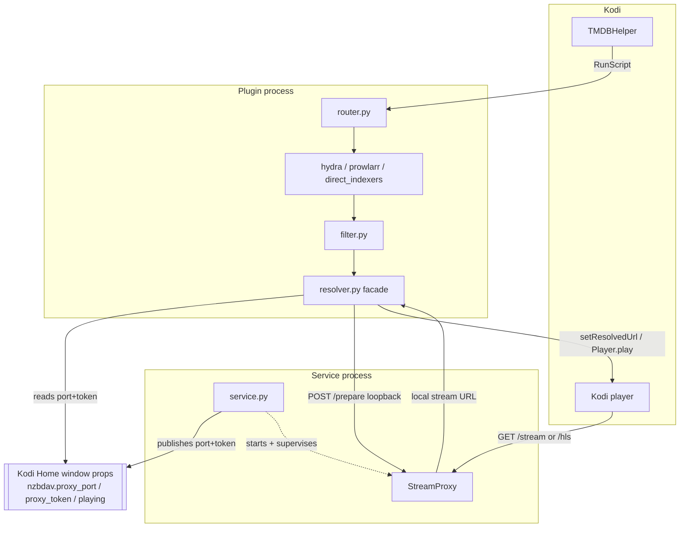
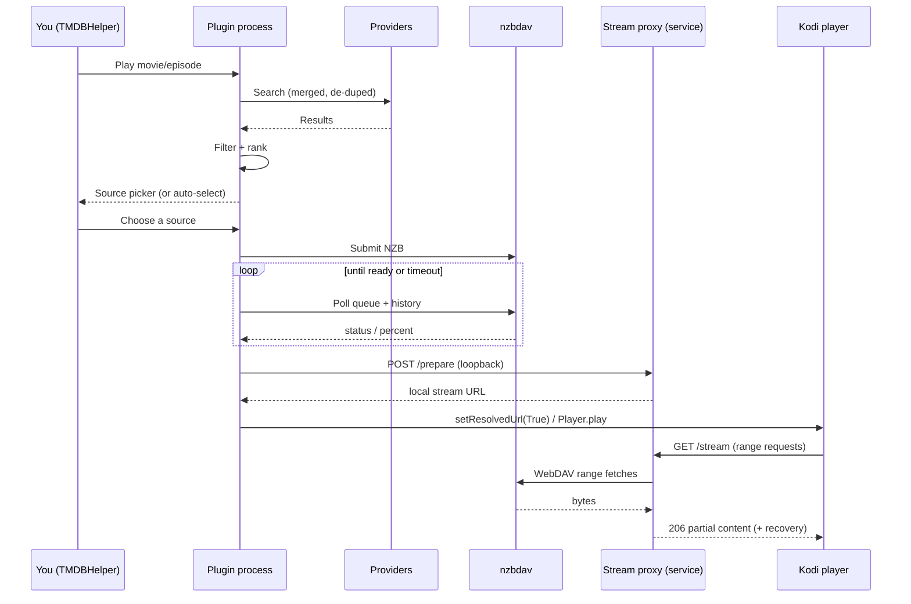
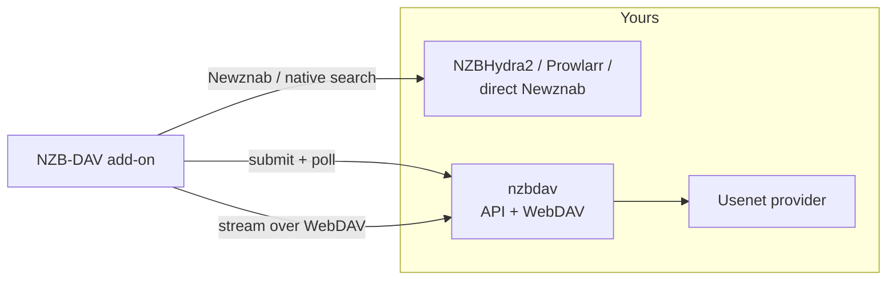

# Architecture

NZB-DAV is a Kodi 21 **player/resolver** add-on. It presents itself to
TMDBHelper as a player, and when you start a title it runs the whole pipeline:
search → filter → submit → poll → proxy → play. This page is the technical map;
the pages that follow drill into each stage.

!!! note "Runtime constraints that shape the design"
    The add-on runtime is **pure Python, 3.8-compatible, with no compiled
    dependencies** — so it runs identically on ARM64 CoreELEC boxes and x86-64
    desktops. Every third-party library (including the release-title parser) is
    vendored. These constraints explain several choices below, such as the
    pure-Python MP4 rewriter and the "no pip installs" rule.

## Two execution contexts

NZB-DAV runs in two separate processes, and understanding the split explains
most of the design.

- **The plugin process** is spawned each time you trigger an action (play,
  search, resolve, a settings test). It does the search, filtering, submission,
  and polling, then hands Kodi a local URL to play.
- **The service process** starts with Kodi (`start="startup"`) and runs for
  Kodi's whole lifetime. It owns the **stream proxy** — a localhost HTTP server
  on a random port. The plugin process reaches it by reading the port and a
  security token from Kodi's Home-window properties and POSTing to a loopback
  `/prepare` endpoint.

This is why Kodi always plays from `127.0.0.1` and never from your WebDAV server
directly.

## Module organization

Three large surfaces — `router.py`, `resolver.py`, and `stream_proxy.py` — are
**façades**. Their logic lives in many sibling modules (`router_*`, `resolver_*`,
`stream_proxy_*`) that are re-imported into the façade. This keeps each file
small while letting the test suite import and patch names from the façade. The
stream proxy in particular is composed from around 40 modules as method mixins.

| Area | Entry point | Key modules |
|------|-------------|-------------|
| Routing | `router.py` | `router_search`, `router_play`, `router_scriptplay`, `router_dispatch` |
| Search | `hydra.py`, `prowlarr.py`, `direct_indexers.py` | `search_planner`, `newznab_caps`, `indexer_manager` |
| Filtering | `filter.py` | `filter_normalize`, `filter_groups`, `filter_fallback` |
| Resolve/poll | `resolver.py` | `resolver_entry`, `resolver_flow`, `resolver_submit`, `resolver_poll`, `resolver_pollloop` |
| Backends | `nzbdav_api.py`, `nzbget_resolver.py` | `nzbdav_api_parsing`, `nzbget_api` |
| WebDAV | `webdav.py` | `webdav_discovery`, `webdav_match` |
| Proxy | `stream_proxy.py` | `stream_proxy_handler_*`, `stream_proxy_mgr_*`, `stream_proxy_hls_*` |
| Fallback | `fallback_streams.py` | `fallback_streams_identity/match/probe/select`, `stream_proxy_handler_cutover` |

## The end-to-end flow

## Invariants that keep Kodi stable

Three rules run through the whole codebase. They exist because breaking them
hangs or crashes Kodi on the target devices:

- **Always resolve the handle.** On the `plugin://` resolve path, Kodi blocks
  until the add-on calls `setResolvedUrl` — `True` on success, `False` on any
  failure, cancellation, or timeout. Every code path, including exceptions,
  routes through a resolution call so Kodi never hangs.
- **Never `time.sleep` in a loop.** Polling and waiting use
  `xbmc.Monitor.waitForAbort`, so a Kodi shutdown aborts the wait immediately
  and shuts down cleanly. Worker threads are daemons.
- **Preserve HTTP range behavior.** Seeking depends on the proxy honoring range
  requests, so the range contract is preserved on every serving path.

## External services

Continue with the [Search pipeline](search-pipeline.md).
