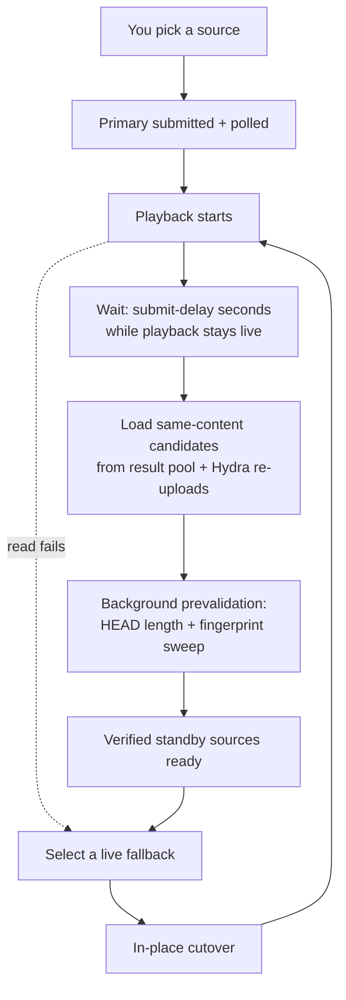
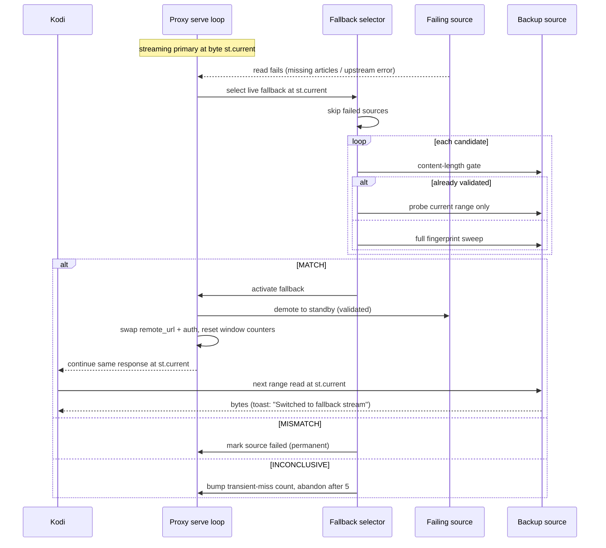

# Fallback cutover

This page explains how NZB-DAV switches to a backup source mid-playback without
interrupting the video. For the user-facing summary, see
[Fallback streams](../features/fallback-streams.md).

## Lifecycle

Backups are prepared lazily. A healthy stream that never stalls submits **none**.
The submit worker waits until playback has been live for the configured delay
(default 120 seconds), because opening extra backend connections during the
fragile startup window can starve the live stream.

### The "playing" liveness signal

The submit worker runs in the plugin process, but playback stop/end events fire
in the service process. They communicate through a cross-process Home-window
property, `nzbdav.playing`:

- It's set `true` when playback monitoring begins.
- It's cleared on stop, end, and terminal-error paths.
- A transient **ERROR is not terminal** — if a retry recovers, the flag stays
  set so backups still flow into the recovered playback.

The worker uses a "seen-live" latch: it only aborts on the flag going false
*after* it has positively observed playback live at least once, which prevents a
startup race from cancelling backups prematurely.

## Choosing candidates

Candidates must be the **same content** (title, year, season/episode, edition,
proper/repack, upscaled). Qualifying candidates are ranked into tiers:

| Tier | Criteria |
|------|----------|
| 0 | Same resolution, codec, and group; size within **3%** |
| 1 | Same resolution and codec |
| 2 | Same resolution, different codec |
| 3 | Same content, otherwise different |

Reposts of the same release within the same **hour** are collapsed to the best-
tier survivor (anchor-based, no transitive merging), and any candidate posted
within that window of the primary's own post date is dropped. The count is then
clamped to **Maximum standby fallback streams** (default 5, hard ceiling 5).

## Verifying a switch is safe

Switching is only safe if the alternate is byte-identical, so NZB-DAV proves it
in two stages:

1. **Content-length equality.** The alternate's total size must **exactly** equal
   the current source's. A mismatch permanently rejects that candidate.
2. **SHA-256 fingerprint sweep.** NZB-DAV compares hashes of matching byte ranges
   sampled deterministically across both files — **20** samples for files under
   1 GiB, up to **100** for larger files, with the first and last ranges always
   included. Every sampled range must match. A missing or empty hash on either
   side is *inconclusive* rather than a match.

Verified standby sources are checked ahead of time on a background thread, so a
live cutover usually skips straight to verifying just the current range.

## The cutover sequence

The key detail: the cutover **doesn't touch the byte offset**. The serve loop is
sitting at `st.current`; after the swap it re-enters the same loop at the same
offset on the same client socket, with the response headers already sent. There
is no `Player.Stop`, no rewind, and no re-sent HTTP headers — which is why the
switch is invisible.

When a switch succeeds, the dead primary is **demoted** into the standby pool
marked validated (it was, after all, serving these exact bytes a moment ago), so
it could even serve later ranges if a subsequent source fails.

## When nothing can recover

For a fallback session, fallback recovery is the *only* rescue path. If no
verified source can resume from the exact byte position, the proxy closes the
stream cleanly rather than retrying the dead source, zero-filling, or skipping
bytes. A clean failure beats a corrupt picture.

## Dead-candidate tracking

NZB-DAV remembers candidates that are **provably unrecoverable** for the session
— a missing first article, an NNTP rejection, or a terminal Failed/Deleted state
— keyed by the indexer download link (the only id stable across resubmits).
Those are never retried. A **timeout is deliberately not treated as dead**: on a
slow backend a timeout means load, not a missing post, so the candidate stays
eligible.
