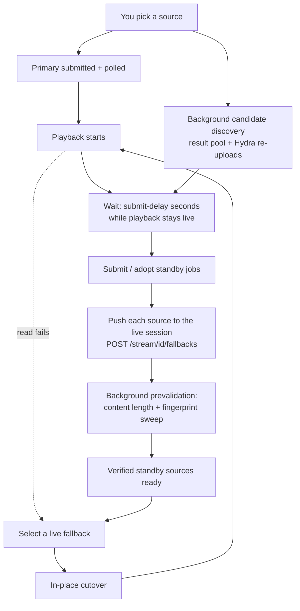
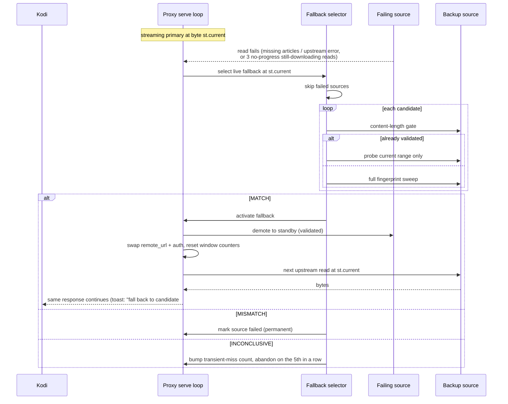

# Fallback cutover

This page explains how NZB-DAV switches to a backup source mid-playback without
interrupting the video. For the user-facing summary, see
[Fallback streams](../features/fallback-streams.md).

Fallback cutover is part of the nzbdav backend only. The
[NZBGet backend](../features/nzbget-backend.md) bypasses this machinery and uses
NZBGet's own duplicate handling. Playback of a remembered season-pack episode
also runs without fallbacks.

## Lifecycle

Candidate discovery starts in the background as soon as you pick a source, so
the Hydra and NZB-manifest lookups overlap the primary download. Nothing is
*submitted*, though, until playback is established: a stream you stop before the
submit delay elapses submits **none**, while steady playback submits its standby
backups once the delay passes. The submit worker waits for the playback-start
signal (giving up on the wait after 300 seconds and submitting late), then for
**Seconds into playback before submitting fallback backups** (default 120,
`0` = at playback start). Opening extra backend connections during the fragile
startup window can starve the live stream. Every backup adopted after
`/prepare` is pushed into the live proxy session, where the prevalidation
warmer picks it up.

The related settings live in **Advanced › Fallback Streams**:
**Enable fallback streams** (on) and **Maximum standby fallback streams**
(default 5, hard ceiling 5).

### The "playing" liveness signal

The submit worker runs in the plugin process, but playback stop/end events fire
in the service process. They communicate through a cross-process Home-window
property, `nzbdav.playing`:

- It's set `true` when playback monitoring begins.
- It's cleared on stop, end, and terminal-error paths.
- A transient **ERROR is not terminal** — if a retry recovers, the flag stays
  set so backups still flow into the recovered playback.

The worker uses a "seen-live" latch: it only aborts on the flag going false
*after* it has positively observed playback live at least once, which prevents a
startup race from cancelling backups prematurely.

## Choosing candidates

A candidate is admitted only when all of these hold:

- It has a different download link from the primary, and its NZB article set
  isn't the primary's (the same upload listed twice is not a backup).
- It's the **same content** (title, year, part, season/episode, edition,
  proper/repack, upscaled).
- It's from the **same release group** at the **same resolution**. Both must
  be parsed; an unknown group or resolution fails closed. Other parsed profile
  fields (HDR, audio channels) must agree too.
- It isn't a [dead candidate](#dead-candidate-tracking).

Admitted candidates are ordered with exact-same video filename first, then by
tier, then by smallest size difference:

| Tier | Criteria |
|------|----------|
| 0 | Same resolution, codec, and group; size within **3%** |
| 1 | Same resolution and codec |
| 2 | Same resolution, different codec |
| 3 | Same content, otherwise different |

Reposts of the same release within the same **hour** are collapsed to the best-
ranked survivor (anchor-based, no transitive merging), and any candidate posted
within that window of the primary's own post date is dropped. The count is then
clamped to **Maximum standby fallback streams**.

## Verifying a switch is safe

Switching is only safe if the alternate's bytes line up exactly, so NZB-DAV proves it
in two stages:

1. **Content-length equality.** The alternate's total size must **exactly** equal
   the current source's. A mismatch permanently rejects that candidate.
2. **SHA-256 fingerprint sweep.** NZB-DAV compares hashes of matching 4 KiB
   byte ranges sampled deterministically across both files — **20** samples for
   files under 1 GiB, **100** for larger files, with the first and last ranges
   always included. Every sampled range must match. A missing or empty hash on either
   side is *inconclusive* rather than a match.

Verified standby sources are checked ahead of time on a background thread, so a
live cutover usually skips straight to verifying just the current range.

## The cutover sequence

The key detail: the cutover **doesn't touch the byte offset**. The serve loop is
sitting at `st.current`; after the swap it re-enters the same loop at the same
offset on the same client socket, with the response headers already sent. There
is no `Player.Stop`, no rewind, and no re-sent HTTP headers — which is why the
switch is invisible.

When a switch succeeds, the dead primary is **demoted** into the standby pool
marked validated (it was, after all, serving these exact bytes a moment ago), so
it could even serve later ranges if a subsequent source fails.

If the new source never delivers a byte before the proxy moves on, the toast
reports that candidate as a failure instead ("fall back to candidate #N was a
failure").

## When nothing can recover

A cutover is tried when a read hits missing articles or an upstream error, or
after three consecutive still-downloading reads at the same offset that make no
progress. If no verified source can take over at the exact byte position, the
proxy doesn't hard-close. It re-enters the primary's retry ladder, so a
primary that is only briefly trickling can still recover. The normal skip-probe
and zero-fill budgets bound the damage.

That fall-through is bounded. After **three** consecutive fall-throughs that
stream no new real upstream bytes, the proxy closes the stream cleanly with
`fallback_exhausted`. Any genuine forward progress resets the count. A terminal
401/403 or contract mismatch is reported as itself rather than as
`fallback_exhausted`.

## Dead-candidate tracking

NZB-DAV remembers candidates that are **provably unrecoverable** for the session
— a missing first article, an NNTP rejection, or a terminal Failed/Deleted state
— keyed by the indexer download link (the only id stable across resubmits).
Those are never retried. A **timeout is deliberately not treated as dead**: on a
slow backend a timeout means load, not a missing post, so the candidate stays
eligible.
