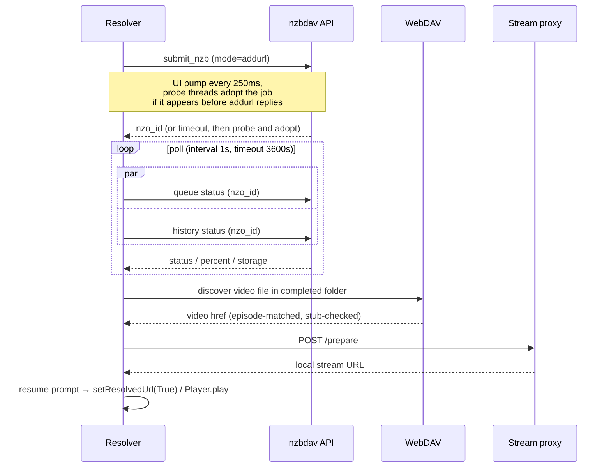

# Playback pipeline

Once you pick a source, NZB-DAV submits it, polls until it's ready, discovers the
playable file, and hands Kodi a local URL. This page covers the nzbdav backend;
the [NZBGet backend](../features/nzbget-backend.md) follows a parallel path.

## The no-hang contract

The resolve path has one non-negotiable rule: **Kodi must always receive a
resolution.** When Kodi asks the add-on to resolve a `plugin://` URL, it blocks
until `setResolvedUrl` is called — `True` with a playable URL, or `False` on any
failure, cancellation, or timeout. Every branch, including exceptions and even a
corrupt-settings read, routes through a resolution call. Settings reads and
dialog creation are deliberately placed inside the try/except so a rare failure
still resolves the handle instead of hanging Kodi.

TMDBHelper's default player entry uses `RunScript`, which reaches
`resolve_and_play()` with no plugin handle. That path starts playback with
`xbmc.Player().play(...)` and on failure only notifies. The same try/except
structure makes sure every exception still ends in a clean notification.

## Submit → poll → resolve

### Submission

Submission runs on a worker thread while the plugin thread pumps the progress
dialog every 250 ms and watches for cancellation. Concurrently, probe threads
watch the queue and history for the job by name and **adopt** it the moment it
appears — often before the submit call even returns. Submission retries up to
three attempts, two seconds apart (the wait is abortable), and classifies
errors carefully:

- A client-side **submit timeout is not a failure** — nzbdav may still be
  fetching and parsing the NZB (routinely slow on a large remux). NZB-DAV probes
  the queue and history to adopt a slow-but-successful submit rather than
  double-submitting.
- Transient HTTP errors (408/502/503/504) retry. An explicit nzbdav rejection or
  a 4xx is terminal and surfaces immediately.
- Other HTTP errors (for example a 500 "duplicate nzo_id") first probe the queue
  and history and adopt a matching job. If none turns up, the error is terminal.
- A "too many requests" error (429) shows a rate-limit notification naming the
  indexer instead of the generic error dialog.

### Polling

Each poll queries the queue and history APIs in parallel. Because nzbdav can
remap the job id when a job moves from queue to history, NZB-DAV also has a
by-name history fallback, gated by the submit timestamp so a stale prior attempt
can't trigger a false failure. When neither API answers within the poll
window, NZB-DAV probes WebDAV reachability to tell a missing job apart from an
unreachable server. The progress dialog maps the backend status to a line:

| Status | Dialog line |
|--------|-------------|
| Queued | Queued… |
| Fetching | Fetching NZB… |
| Propagating | Waiting for propagation… |
| Downloading | Downloading… *n*% |
| Paused | Paused |
| Failed | nzbdav's failure message, or *Download failed* |

## Finding the right video file

When a job completes, NZB-DAV maps the completed storage path to a WebDAV path
and lists the folder with a `PROPFIND` (`Depth: 1` per level, recursion capped
a few levels deep, XML parsed with entity declarations refused). It then chooses
the playable file:

- Video extensions recognized: `.mkv`, `.mp4`, `.avi`, `.m4v`, `.ts`, `.m2ts`,
  `.wmv`, `.mov`.
- For a **TV season pack**, NZB-DAV matches the requested season/episode against
  filenames — handling multi-episode and range patterns — and recurses into
  subfolders when needed. A named wrong episode fails closed rather than being
  selected for its size.
- With an explicit episode request, one generic video may retain the ordinary
  single-file fallback. Multiple untagged videos are ambiguous and fail closed
  instead of selecting one by size. Without episode context, discovery
  preserves the legacy largest-video behavior.

### Guarding against "Completed but broken"

A backend can report *Completed* while the file is really a placeholder or is
missing its middle article bodies. NZB-DAV runs two guards, and **both fail open**
(they only reject on positive evidence of a problem, never on missing data):

- **Stub guard** — rejects the folder when its total video bytes are under half
  the advertised release size, or when the picked file is a tiny fraction of the
  largest sibling video. This catches nzbdav's ~30-second job-start placeholder.
- **Body guard** — after a `HEAD`, issues a 64 KiB range `GET` from the middle
  of the file. A `≥400` or an empty body means the bodies aren't really there.

## Remembering completed season packs

!!! info "Beta feature"
    Added in 2.0.0-beta.2 — available on the [Beta channel](../getting-started/beta-channel.md).

After a confirmed completed-folder inventory, a folder containing at least two
reliably named episodes from exactly one season is recorded for later reuse.
For nzbdav/WebDAV, recording is deferred until the selected stream passes body
validation; NZBGet records from the reachable completed-folder inventory on its
SMB or local/mounted completed-downloads path. The catalog is stored in the
add-on profile at
`special://profile/addon_data/plugin.video.nzbdav/season_packs.json` and is
bounded to the 100 most recently confirmed jobs.

One record represents one completed backend job. Its key is the backend plus
the exact native job identifier (`nzo_id` for nzbdav or `NZBID` for NZBGet), and
it also retains that job's native completed folder. Records are never combined
by filename or release name.

For a later request, the router prepends an already-downloaded season-pack row
only when the catalog says that exact episode is present. Selection validates
the exact history identifier and folder, inventories the folder again, and
requires an exact episode match before playback; it does not submit another
NZB or substitute a differently named episode. Conclusively missing or changed
jobs become stale. Transient API, authentication, network, parsing, or storage
errors fail soft and preserve the record for a later attempt.

## Queue clearing

Before submitting, NZB-DAV can clear nzbdav's download queue, controlled by
**Clear download queue when starting a new download** (**Advanced › Polling**;
Ask / Always clear / Never, default Ask). It excludes this title's own
in-flight job, skips clearing when a completed copy you could reuse already
exists, and — in Ask mode — shows a Keep/Clear prompt *before* the progress
dialog so it's never hidden behind the modal. Any probe or dialog
failure leaves the queue untouched.

## Resume

NZB-DAV tracks resume points **per release identity** (title + size + post date),
not per stream URL — so resume survives the churning proxy/WebDAV URL and stays
distinct per episode. On replay it shows Kodi's native **Resume from…** /
**Start from beginning** prompt (honoring your Kodi play-action preference). It
also scrubs Kodi's own bookmark for the outer `plugin://` URL, which otherwise
causes a replay to try reopening the plugin URL as a stream and fail.

## Handing off to the proxy

On a validated, playable stream, the resolver POSTs to the service's loopback
`/prepare` endpoint, receives a local URL, and resolves the resume choice. It
then sets the `nzbdav.active` / `nzbdav.stream_url` Home-window properties for
the service's playback monitor and starts playback: `setResolvedUrl(True)` on
the `plugin://` path, `xbmc.Player().play(...)` on the RunScript path. Playback
then flows entirely through the [stream proxy](stream-proxy.md).
