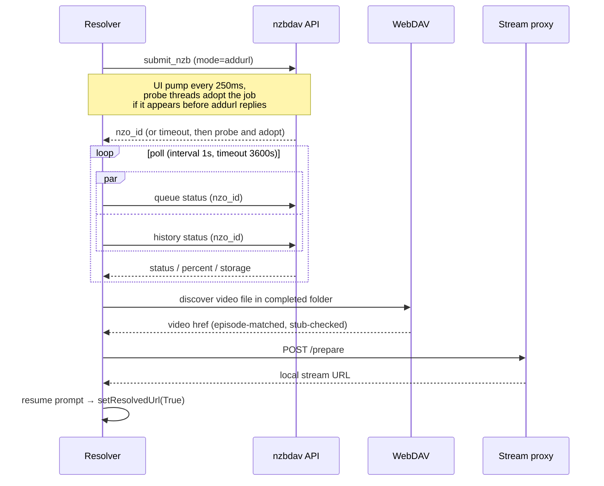

# Playback pipeline

Once you pick a source, NZB-DAV submits it, polls until it's ready, discovers the
playable file, and hands Kodi a local URL. This page covers the nzbdav backend;
the [NZBGet backend](../features/nzbget-backend.md) follows a parallel path.

## The no-hang contract

The resolve path has one non-negotiable rule: **Kodi must always receive a
resolution.** When Kodi asks the add-on to resolve a `plugin://` URL, it blocks
until `setResolvedUrl` is called — `True` with a playable URL, or `False` on any
failure, cancellation, or timeout. Every branch, including exceptions and even a
corrupt-settings read, routes through a resolution call. Settings reads and
dialog creation are deliberately placed inside the try/except so a rare failure
still resolves the handle instead of hanging Kodi.

## Submit → poll → resolve

### Submission

Submission runs on a worker thread while the plugin thread pumps the progress
dialog every 250 ms and watches for cancellation. Concurrently, probe threads
watch the queue and history for the job by name and **adopt** it the moment it
appears — often before the submit call even returns. Submission retries up to
three times with backoff, and classifies errors carefully:

- A client-side **submit timeout is not a failure** — nzbdav may still be
  fetching and parsing the NZB (routinely slow on a large remux). NZB-DAV probes
  the queue and history to adopt a slow-but-successful submit rather than
  double-submitting.
- Transient HTTP errors (408/502/503/504) retry; a rejection or a 4xx is
  terminal and surfaces immediately.
- A "too many requests" (429) shows a rate-limit message naming the indexer.

### Polling

Each poll queries the queue and history APIs in parallel. Because nzbdav can
remap the job id when a job moves from queue to history, NZB-DAV also has a
by-name history fallback, gated by the submit timestamp so a stale prior attempt
can't trigger a false failure. The progress dialog maps the backend status to a
line:

| Status | Dialog line |
|--------|-------------|
| Queued | Queued… |
| Fetching | Fetching NZB… |
| Propagating | Waiting for propagation… |
| Downloading | Downloading… *n*% |
| Paused | Paused |
| Failed / Deleted | Download failed |

## Finding the right video file

When a job completes, NZB-DAV maps the completed storage path to a WebDAV path
and lists the folder with a `PROPFIND` (depth-limited, external entities
disabled). It then chooses the playable file:

- Video extensions recognized: `.mkv`, `.mp4`, `.avi`, `.m4v`, `.ts`, `.wmv`,
  `.mov`.
- For a **TV season pack**, NZB-DAV matches the requested season/episode against
  filenames — handling multi-episode and range patterns — and recurses into
  subfolders when needed. A named wrong episode fails closed rather than being
  selected for its size.
- When filenames have no reliable episode tags, discovery retains the legacy
  largest-video fallback because an exact episode cannot be proven.

## Remembering completed season packs

After exact file discovery and stream validation, a folder containing at least
two reliably named episodes from exactly one season is recorded for later
reuse. This works with both nzbdav/WebDAV and NZBGet/SMB. The catalog is stored
in the add-on profile at
`special://profile/addon_data/plugin.video.nzbdav/season_packs.json` and is
bounded to the 100 most recently confirmed jobs.

One record represents one completed backend job. Its key is the backend plus
the exact native job identifier (`nzo_id` for nzbdav or `NZBID` for NZBGet), and
it also retains that job's native completed folder. Records are never combined
by filename or release name.

For a later request, the router prepends an already-downloaded season-pack row
only when the catalog says that exact episode is present. Selection validates
the exact history identifier and folder, inventories the folder again, and
requires an exact episode match before playback; it does not submit another
NZB or substitute a differently named episode. Conclusively missing or changed
jobs become stale. Transient API, authentication, network, parsing, or storage
errors fail soft and preserve the record for a later attempt.

### Guarding against "Completed but broken"

A backend can report *Completed* while the file is really a placeholder or is
missing its middle article bodies. NZB-DAV runs two guards, and **both fail open**
(they only reject on positive evidence of a problem, never on missing data):

- **Stub guard** — compares the folder's total video bytes against the
  advertised size (and against the largest sibling), catching ~30-second
  placeholder files.
- **Body guard** — after a `HEAD`, issues a mid-file range `GET`; a `≥400` or an
  empty body means the bodies aren't really there.

## Queue clearing

Before submitting, NZB-DAV can clear your backend's download queue, controlled by
**Clear download queue when starting a new download** (Ask / Always / Never). It
excludes this title's own in-flight job, skips clearing when a completed copy you
could reuse already exists, and — in Ask mode — shows a Keep/Clear prompt *before*
the progress dialog so it's never hidden behind the modal. Any probe or dialog
failure leaves the queue untouched.

## Resume

NZB-DAV tracks resume points **per release identity** (title + size + post date),
not per stream URL — so resume survives the churning proxy/WebDAV URL and stays
distinct per episode. On replay it shows Kodi's native **Resume from…** /
**Start from beginning** prompt (honoring your Kodi play-action preference). It
also scrubs Kodi's own bookmark for the outer `plugin://` URL, which otherwise
causes a replay to try reopening the plugin URL as a stream and fail.

## Handing off to the proxy

On a validated, playable stream, the resolver POSTs to the service's loopback
`/prepare` endpoint, receives a local URL, resolves the resume choice, and calls
`setResolvedUrl(True)`. Playback then flows entirely through the
[stream proxy](stream-proxy.md).
