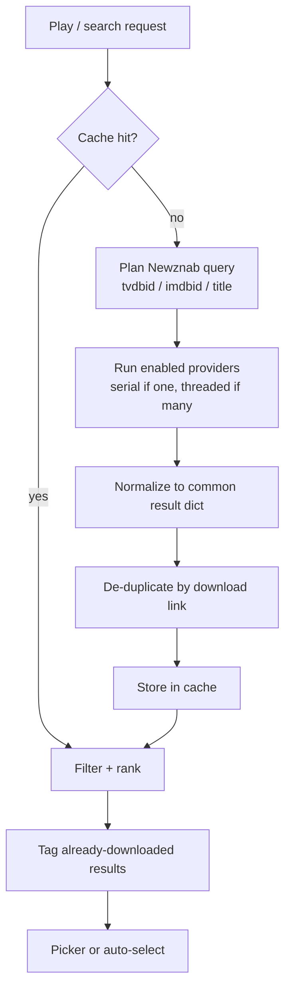

# Search pipeline

This page traces a search from the moment you select a title to the ranked list
you see in the picker.

## Overview

## Query planning

A shared planner builds each provider's query from the title and any ids:

- **Episodes** prefer a **TVDB id**, then an **IMDb id**, then fall back to a
  cleaned title, plus season and episode numbers.
- **Movies** use the **IMDb id**, else a cleaned title.
- When an indexer advertises its capabilities (caps), the planner honors the
  supported parameters for each search type; without caps it uses sensible
  defaults.
- If an id-based query returns nothing, NZB-DAV retries by title so a missing or
  mismatched id never leaves you empty-handed.

**Prowlarr** is a special case: its native search API doesn't take id parameters,
so NZB-DAV embeds them as tokens inside the query text — `{tvdbid:…}`,
`{imdbid:…}`, `{season:…}`, `{episode:…}`.

## Provider fan-out

Each enabled provider runs as a job. A single provider runs inline; multiple
providers run concurrently, one worker thread each. Direct indexers additionally
fan out across themselves in parallel with a bounded worker pool and a fan-out
deadline, so one slow indexer can't stall the search.

## Result normalization

Every provider maps its response into one common shape:

| Field | Meaning |
|-------|---------|
| `title` | Release name (parsed for quality metadata) |
| `link` | Download URL for the NZB (the de-duplication key) |
| `size` | Size in bytes, as a string |
| `indexer` | Source indexer name |
| `pubdate` | Usenet post date, normalized to RFC-2822 |
| `age` | Human-readable age string |

!!! info "Why pubdate is normalized to RFC-2822"
    Prowlarr reports ISO-8601 dates; Newznab reports RFC-2822. NZB-DAV
    normalizes everything to RFC-2822 because post date drives sorting,
    same-repost de-duplication, and the download ledger. An unparseable date
    sorts at the epoch, which is why the format contract matters.

## De-duplication

Results are de-duplicated by **download link** — first occurrence wins, and a
result with no link is dropped as unplayable. The same release offered by two
providers with *different* download URLs is intentionally kept as two rows,
because they are genuinely different downloads.

## Title parsing (PTT)

NZB-DAV parses each release title with a vendored copy of *parse-torrent-title*
to extract resolution, HDR, audio, codec, group, languages, edition, year, and
flags such as PROPER/REPACK. If the parser throws or returns nothing useful, a
regex fallback extracts the essentials. The normalized metadata is cached on the
result and reused by filtering, ranking, and fallback matching.

## Filtering and ranking

Filtering applies your format, keyword, size, and excluded-group rules. Each
format category has a default-enabled **Other / Unknown** option. Missing HDR
is unknown, while an explicit SDR tag is SDR. Addon-owned tag normalization
corrects audio families, HDR aliases, dimensions, and language names without
editing vendored PTT. See [Quality filtering](../features/quality-filtering.md).

Under **Relevance** sort, results are ordered by this priority tuple:

The preferred tiers apply to all releases. Explicit size or age sorting
bypasses the relevance priorities.

## Caching

The merged, **pre-filter** results are cached on disk, keyed by a SHA-256 of the
search type, title, year, and ids. That means:

- Re-opening the same title is instant within the cache duration (default 60 s).
- Changing filter or sort settings takes effect immediately — no new search
  needed, because filtering runs fresh on every read.
- The cache self-limits to 50 MB and 1000 entries, evicting the oldest first,
  and writes atomically.

Set **Cache duration** to `0` to disable caching, or clear it any time from the
add-on's main menu.

Next: the [Playback pipeline](playback-pipeline.md).
