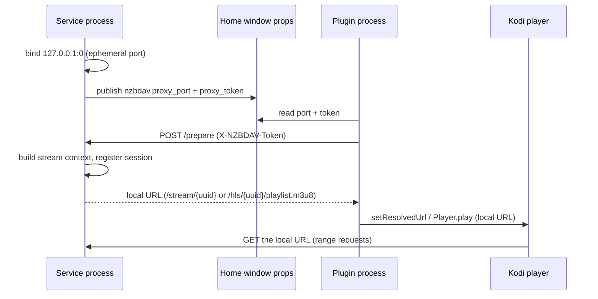
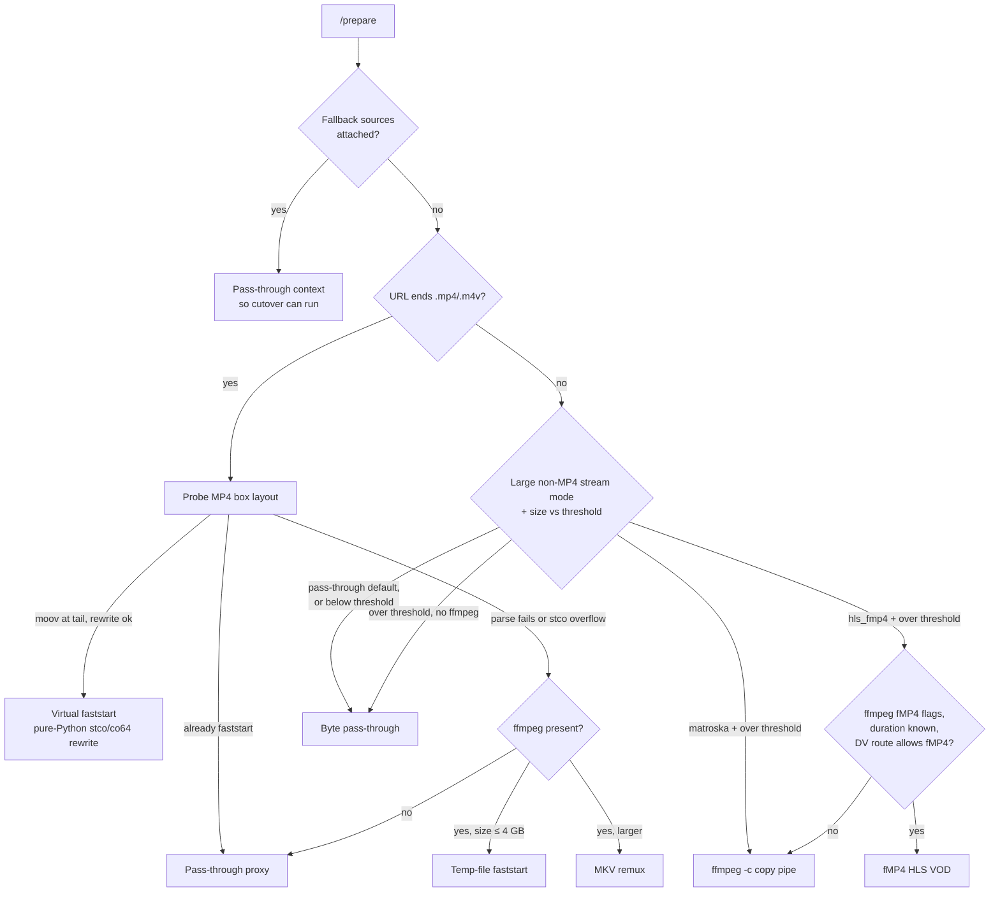

# Stream proxy

The stream proxy is a localhost HTTP server that runs inside NZB-DAV's background
service. Every playback flows through it, and it's where seeking, format
handling, and gap recovery happen.

## Why a proxy exists

The proxy solves four problems that Kodi's native input streams can't on the
target devices (Kodi 21, 32-bit CoreELEC/Amlogic):

1. **PROPFIND on the parent directory.** Kodi PROPFINDs the parent folder before
   a WebDAV file GET; on nzbdav this can trigger a recursive scan that throws
   `Open - Unhandled exception`. A localhost server that answers only GET/HEAD
   sidesteps it.
2. **MP4 `moov` at the tail.** REMUX rips often place the `moov` atom after the
   media data; Kodi can't start those without a full download. The proxy rewrites
   them in pure Python.
3. **32-bit cache offset bug.** On 32-bit Kodi, pass-through of a file with a
   large advertised size crashes at byte 0. The remux tiers hide the true size
   behind an unsized stream.
4. **Missing Usenet articles.** nzbdav returns HTTP errors on unrecoverable
   ranges; the proxy catches these mid-stream and recovers.

## How Kodi is handed a local URL

The proxy binds an **ephemeral port** on `127.0.0.1` and publishes it plus a
per-instance random token to Kodi's Home window. The service restarts the proxy
if its server thread dies. The plugin process reads them and POSTs to
`/prepare`; the service builds the stream context (it owns the session table)
and returns the local URL. Only one session lives at a time — preparing a new
one tears the previous down, killing any ffmpeg process and cleaning its work
directory.

## The serving decision tree

The classification order is: attached fallback sources force a pass-through
context (so [cutover](fallback-cutover.md) can run); otherwise `.mp4`/`.m4v`
URLs take the MP4 branch; everything else takes the default branch, where the
**Large non-MP4 stream mode** and **Force ffmpeg remux above (MB, 0=off)**
(both in **Advanced › Proxy**) decide between pass-through and a remux tier.
The mode defaults to **Direct pass-through (default)**; the threshold defaults
to 15000 MB, and `0` turns force-remux off. A source whose length can't be
determined is remuxed whenever a remux mode is selected.

!!! note "There is no direct-redirect tier"
    An already-faststart MP4 is *proxied* through `/stream/<uuid>`, not handed
    back to Kodi as the remote URL. Kodi never receives the WebDAV URL.

## The serving paths and seeking

| Path | ffmpeg? | Seeking |
|------|---------|---------|
| **Pass-through** (default for MKV/other, and for faststart MP4) | No | Native HTTP range seeking |
| **Virtual faststart** (tail-`moov` MP4) | No | Native range seeking |
| **Temp-file faststart** (MP4 the rewriter can't handle, ≤ 4 GB) | Yes | Native range seeking over a local copy |
| **Matroska remux** | Yes | Cache-bounded: Kodi can only seek within what it has already buffered |
| **fMP4 HLS** (VOD playlist + `init.mp4` + segments) | Yes | Full random seek via 6-second segments |

- **Virtual faststart** serves a virtual file with the `moov` moved to the front
  and its `stco`/`co64` chunk offsets rewritten in pure Python. If a 32-bit
  `stco` table would overflow, the MP4 falls to the next tier.
- **Temp-file faststart** runs `ffmpeg -movflags +faststart` into a local temp
  file and serves that file with range support.
- **Matroska remux** (`ffmpeg -c copy -f matroska pipe:1`) is one unsized `200`
  response with `Accept-Ranges: none`. ffmpeg is never restarted at a new
  position (no `-ss`), which is why seeking is bounded by Kodi's cache.
- **fMP4 HLS** serves ffmpeg's own playlist once it exists (and a proxy-built
  one before that). The first init segment is kept and re-served across seek
  respawns.

Pass-through reads upstream in 64 KB chunks (heap-safe on 32-bit), and on a
mid-stream read failure it **skip-probes forward** to the next readable offset
and zero-fills the gap so the decoder keeps running. For video, a throughput
watchdog also closes the response when proxy-to-Kodi throughput stays under
100 KB/s over a 20-second window. Kodi then reconnects with a fresh upstream
fetch instead of wedging on a trickle. Pass-through is also the only path where
a [fallback cutover](fallback-cutover.md) can happen.

## Resilience knobs — exact behavior

These live in **Advanced › Pass-through validation** and are read once per
session. Defaults in parentheses.

| Knob | Behavior |
|------|----------|
| **Strict upstream contract mode** (Warn only) | Validates the upstream's status, `Content-Range`, and `Content-Length`. **Off** disables the density breaker entirely; **Enforce** treats a contract violation as fatal. |
| **Enable density breaker** (off) | When contract mode isn't Off, aborts the stream if a rolling 16 MB window becomes more than 50% zero-fill — i.e. the source has gone mostly synthetic (a dead release). |
| **Enable zero-fill budget** (on) | Caps zero-fill at 64 MB per response and 5% of the session; exceeding it ends the stream with a clean error rather than serving mostly-fake bytes. |
| **Enable retry ladder before skip probe** (on) | Re-issues the original range with 2/4/8-second backoff on transient errors before skip-probing. A fresh open uses a short 0.25/0.5/1-second ladder so playback doesn't hang silently at the start. |
| **Max seconds to wait for a slow/stalled backend before giving up (0=off)** (120 s, max 600) | For an *established* stream that stalls on a recoverable backend condition (still-downloading or a transient 5xx), holds Kodi's connection open with abortable backoff up to this budget; the clock resets on any real forward byte. Doesn't apply to genuinely missing articles (those zero-fill) or a fresh open. |
| **Read-ahead buffer size in MB (keeps filling while paused; 0=off)** (256 MB, max 4096) | A bounded forward prefetch, so resuming after a pause is instant. `0` behaves exactly as if there were no buffer. |
| **Send 200 for no-range pass-through** (off) | Sends `200 OK` instead of `206` when Kodi requests a full object. |

## Dolby Vision routing

When fMP4 HLS is selected, NZB-DAV probes the first HEVC access unit for a Dolby
Vision RPU (pure Python, no ffmpeg) and routes by profile, because DV over HLS
hangs the decoder on Amlogic in several cases:

| Classification | Route | Reason |
|----------------|-------|--------|
| P7 FEL (dual-layer) | Matroska | fMP4 can't carry the enhancement layer |
| P7 MEL | fMP4 HLS | Metadata-only EL (experimental) |
| P5 / P8 / other DV | Matroska | Safest on Amlogic |
| Non-DV | fMP4 HLS | — |
| Unknown | Matroska | Fail-safe |

This is why fMP4 HLS is labeled experimental and is never the default: even with a correct DV
configuration record, DV HEVC over fMP4 HLS on CoreELEC-Amlogic can download
every segment and then produce zero frames, stalling around the 30-second mark.
The matroska pipe path doesn't trigger the code that causes it.

## ffmpeg is optional

ffmpeg is discovered once when the proxy starts, along with a probe for the HLS
fMP4 muxer flags. The pass-through and virtual-faststart paths never need it.
When a tier *wants* remux but no ffmpeg is present, the proxy falls back to
pass-through with a warning. If ffmpeg lacks the fMP4 HLS flags, the HLS mode
uses the piped Matroska path instead. If ffmpeg is present but can't produce
a valid fMP4 init segment within 30 seconds, the session is **rewritten to the
matroska path before Kodi ever sees the URL** — so a broken HLS setup never
reaches the player. Credentials are passed to ffmpeg via an `Authorization`
header argument rather than embedded in the URL, so they don't leak into logs.

Next: how a failing source is swapped out live — [Fallback cutover](fallback-cutover.md).
