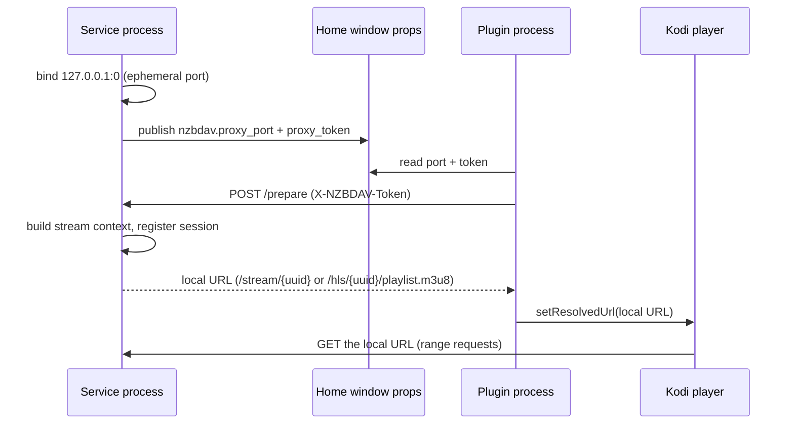
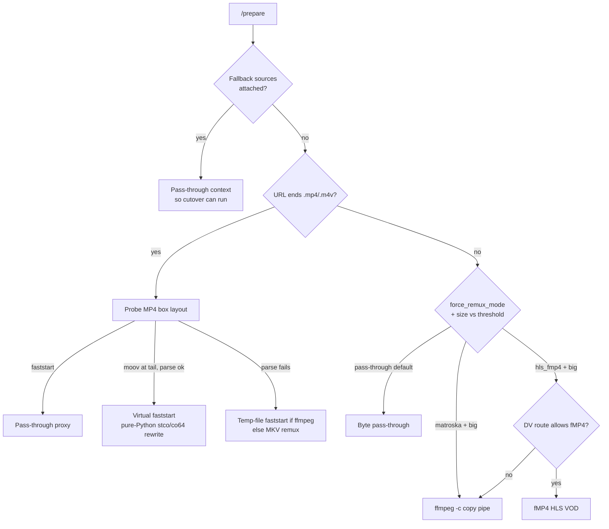

# Stream proxy

The stream proxy is a localhost HTTP server that runs inside NZB-DAV's background
service. Every playback flows through it, and it's where seeking, format
handling, and gap recovery happen.

## Why a proxy exists

The proxy solves four problems that Kodi's native input streams can't on the
target devices (Kodi 21, 32-bit CoreELEC/Amlogic):

1. **PROPFIND on the parent directory.** Kodi PROPFINDs the parent folder before
   a WebDAV file GET; on nzbdav this can trigger a recursive scan that throws
   `Open - Unhandled exception`. A localhost server that answers only GET/HEAD
   sidesteps it.
2. **MP4 `moov` at the tail.** REMUX rips often place the `moov` atom after the
   media data; Kodi can't start those without a full download. The proxy rewrites
   them in pure Python.
3. **32-bit cache offset bug.** On 32-bit Kodi, pass-through of a file with a
   large advertised size crashes at byte 0. The remux tiers hide the true size
   behind an unsized stream.
4. **Missing Usenet articles.** nzbdav returns HTTP errors on unrecoverable
   ranges; the proxy catches these mid-stream and recovers.

## How Kodi is handed a local URL

The proxy binds an **ephemeral port** and publishes it plus a per-instance
security token to Kodi's Home window. The plugin process reads them and POSTs to
`/prepare`; the service builds the stream context (it owns the session table)
and returns the local URL. Only one session lives at a time — preparing a new
one tears the previous down, killing any ffmpeg process and cleaning its work
directory.

## The serving decision tree

The classification order is: attached fallback sources force a pass-through
context (so [cutover](fallback-cutover.md) can run); otherwise `.mp4`/`.m4v`
URLs take the MP4 branch; everything else takes the default branch, where the
**Large non-MP4 stream mode** and the size threshold decide between pass-through
and a remux tier.

!!! note "There is no direct-redirect tier"
    An already-faststart MP4 is *proxied* through `/stream/<uuid>`, not handed
    back to Kodi as the remote URL. Kodi never receives the WebDAV URL.

## The serving paths and seeking

| Path | ffmpeg? | Seeking |
|------|---------|---------|
| **Pass-through** (default for MKV/other, and for faststart MP4) | No | Native HTTP range seeking. |
| **Virtual faststart** (tail-`moov` MP4) | No | Native range seeking; `stco`/`co64` offsets are rewritten in pure Python so 4 GB+ files work on 32-bit Kodi. |
| **Matroska remux** (`ffmpeg -c copy -f matroska pipe:1`) | Yes | No HTTP range; a seek past a 10 MB threshold respawns ffmpeg with `-ss`, so seeking is **approximate** to the nearest keyframe. |
| **fMP4 HLS** (VOD playlist + `init.mp4` + segments) | Yes | Full random seek via 6-second segments; the playlist is generated by the proxy, and the canonical init segment survives seek respawns. |

Pass-through reads upstream in small chunks (heap-safe on 32-bit), and on a
mid-stream read failure it **skip-probes forward** to the next readable offset
and zero-fills the gap so the decoder keeps running.

## Resilience knobs — exact behavior

These are read once per session. Defaults in parentheses.

| Knob | Behavior |
|------|----------|
| **Strict upstream contract mode** (Warn) | Validates the upstream's status, `Content-Range`, and `Content-Length`. **Off** disables the density breaker entirely; **Enforce** treats a contract violation as fatal. |
| **Density breaker** (off) | When contract mode isn't Off, aborts the stream if a rolling 16 MB window becomes more than 50% zero-fill — i.e. the source has gone mostly synthetic (a dead release). |
| **Zero-fill budget** (on) | Caps zero-fill at 64 MB per response and 5% of the session; exceeding it ends the stream with a clean error rather than serving mostly-fake bytes. |
| **Retry ladder** (on) | Re-issues the original range with backoff on transient errors before skip-probing. A fresh open uses a short ladder so playback doesn't hang silently at the start. |
| **Passthrough stall wait** (120 s) | For an *established* stream that stalls on a recoverable backend condition (still-downloading or a transient 5xx), holds Kodi's connection open with abortable backoff up to this budget; the clock resets on any real forward byte. Doesn't apply to genuinely missing articles (those zero-fill) or a fresh open. |
| **Read-ahead buffer** (256 MB) | A bounded forward prefetch that keeps filling even while paused, so resume is instant; `0` is byte-for-byte identical to no buffer. |
| **Send 200 for no-range** (off) | Sends `200 OK` instead of `206` when Kodi requests a full object. |

## Dolby Vision routing

When fMP4 HLS is selected, NZB-DAV probes the first HEVC access unit for a Dolby
Vision RPU (pure Python, no ffmpeg) and routes by profile, because DV over HLS
hangs the decoder on Amlogic in several cases:

| Classification | Route | Reason |
|----------------|-------|--------|
| P7 FEL (dual-layer) | Matroska | fMP4 can't carry the enhancement layer |
| P7 MEL | fMP4 HLS | Metadata-only EL (experimental) |
| P5 / P8 / other DV | Matroska | Safest on Amlogic |
| Non-DV | fMP4 HLS | — |
| Unknown | Matroska | Fail-safe |

This is why `force_remux_mode` defaults away from fMP4: even with a correct DV
configuration record, DV HEVC over fMP4 HLS on CoreELEC-Amlogic can download
every segment and then produce zero frames, stalling around the 30-second mark.
The matroska pipe path doesn't trigger the code that causes it.

## ffmpeg is optional

ffmpeg is discovered once at service start. The pass-through and virtual-faststart
paths never need it. When a tier *wants* remux but no ffmpeg is present, the proxy
falls back to pass-through with a warning. If ffmpeg is present but can't produce
a valid fMP4 init segment within 30 seconds, the session is **rewritten to the
matroska path before Kodi ever sees the URL** — so a broken HLS setup never
reaches the player. Credentials are passed to ffmpeg via an `Authorization`
header argument rather than embedded in the URL, so they don't leak into logs.

Next: how a failing source is swapped out live — [Fallback cutover](fallback-cutover.md).
