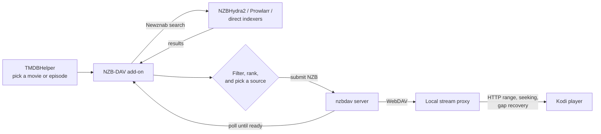

# NZB-DAV for Kodi

**NZB-DAV** turns Usenet into a streaming source inside Kodi. You browse movies
and TV shows in [TMDBHelper](https://github.com/jurialmunkey/plugin.video.themoviedb.helper),
select a title, and NZB-DAV searches your indexers, starts the download on your
[nzbdav](https://github.com/nzbdav-dev/nzbdav) server, and plays the file the
moment it's ready — with a progress bar, seeking, and automatic recovery when a
source goes bad. You never touch an NZB file.

!!! note "This add-on provides software, not content"
    NZB-DAV ships no media and no indexers. You bring your own NZBHydra2 or
    Prowlarr (or direct Newznab indexers), your own nzbdav or InfiniDysk
    server (or NZBGet), and your own Usenet provider. NZB-DAV connects those
    pieces to Kodi.

!!! info "Stable 1.2.3 and Beta 2.0.0"
    NZB-DAV is published on a **Stable** channel (currently 1.2.3) and a
    **Beta** channel (currently 2.0.0-beta.2). This site documents the newest
    code, so some features are marked **Beta feature**. See
    [Beta channel and beta features](getting-started/beta-channel.md) for
    what's new and how to switch.

## What it does

nzbdav (or InfiniDysk) handles both fetching and serving over WebDAV, so you
don't need a separate download client. A background stream proxy inside the add-on gives you
seeking, on-the-fly remuxing, and mid-playback source switching.

## Choose a backend

NZB-DAV plays through one of two kinds of backend. You pick one with the
**Use NZBGet instead of nzbdav for playback** switch on the **NZBGet** settings
tab.

| | **Streaming:** [nzbdav](https://github.com/nzbdav-dev/nzbdav) or [InfiniDysk](https://www.infinidysk.com/) ([GitHub](https://github.com/infinidysk/infinidysk)) | **Download first:** [NZBGet](https://github.com/nzbgetcom/nzbget) *(beta)* |
|---|---|---|
| **How it plays** | Streams straight from Usenet over WebDAV while the release is still being fetched. | NZBGet downloads the whole release, repairs and unpacks it, then Kodi plays the finished file from your NAS. |
| **Time to first frame** | Seconds. | Minutes. On a fast connection a typical release takes a few minutes, and a huge BD100 disc remux can take 15–30 minutes. |
| **Missing or broken articles** | Can't be repaired while streaming. NZB-DAV works around them with [gap recovery and fallback streams](features/fallback-streams.md), but a badly damaged release can still stall or drop out mid-stream. | NZBGet checks and repairs the download with the release's **par2** parity files (when the release has them and NZBGet's par check is enabled) before you press play. NZB-DAV plays the file only after NZBGet reports success, and [Smart Duplicates](features/nzbget-backend.md#smart-duplicates-failover) falls back to another copy if a release can't be repaired. |
| **What you need** | An nzbdav or InfiniDysk server. | An NZBGet server plus storage that Kodi can read, ideally a NAS [mounted over NFS](features/nzbget-backend.md#recommended-mount-the-completed-folder-over-nfs). |

**Which one should I use?**

- **InfiniDysk** is recommended over nzbdav if you want to stream. It's the
  maintained fork of nzbdav, with the same WebDAV server and API, so it's a
  drop-in replacement: NZB-DAV connects to it through the same
  nzbdav connection settings.
- **NZBGet is the most reliable option of all**, as long as you're willing to
  wait for the download to finish. The file is fully downloaded (and
  par2-repaired when the release includes parity files) before playback
  starts, so missing articles can't interrupt the stream.
- If playback through nzbdav **drops out mid-stream**, especially with
  releases that often have broken articles, and you have a NAS or storage
  server, switching to NZBGet is highly recommended. NZBGet is the only
  download-first client NZB-DAV supports; it talks to NZBGet through NZBGet's
  JSON-RPC API.

See [NZBGet backend](features/nzbget-backend.md) for setup.

## Key capabilities

-   :material-magnify: __Multi-provider search__

    Query NZBHydra2, Prowlarr, or direct Newznab indexers — together or
    individually. Results are merged, de-duplicated, and ranked.

    [:octicons-arrow-right-24: Search and indexers](features/search-and-indexers.md)

-   :material-filter-variant: __Precise quality filtering__

    Filter by resolution, HDR format, audio codec, video codec, language,
    release group, size, and keywords. Rank by relevance, size, or age.

    [:octicons-arrow-right-24: Quality filtering](features/quality-filtering.md)

-   :material-play-speed: __Reliable playback with seeking__

    A local proxy preserves HTTP range seeking, rewrites tail-`moov` MP4s in
    pure Python, and offers optional remux tiers for large or awkward files.

    [:octicons-arrow-right-24: Playback and remux](features/playback-and-remux.md)

-   :material-swap-horizontal: __Self-healing fallback streams__

    If a source loses articles mid-playback, NZB-DAV switches to a verified
    alternate release (matched by length + sampled SHA-256) without stopping or
    rewinding.

    [:octicons-arrow-right-24: Fallback streams](features/fallback-streams.md)

-   :material-download-network: __NZBGet backend__ *(beta)*

    Use NZBGet instead of nzbdav. NZB-DAV downloads, then plays the finished
    file from an SMB share or a local or mounted folder, with automatic
    failover to a backup release and exact season-pack episode reuse.

    [:octicons-arrow-right-24: NZBGet backend](features/nzbget-backend.md)

## Get started

If your indexers and nzbdav server are already running, you can be streaming in
a few minutes:

1. [Check the prerequisites](getting-started/prerequisites.md).
2. [Install the add-on](getting-started/installation.md) from the Appz4Fun Kodi
   repository, on the Stable or
   [Beta](getting-started/beta-channel.md) channel.
3. [Configure your connections](getting-started/configuration.md) and test them.
4. [Set up TMDBHelper](getting-started/tmdbhelper.md) to use NZB-DAV as a player.
5. [Play your first title](getting-started/first-playback.md).

## Compatibility at a glance

| Area | Support |
|------|---------|
| Kodi | 21 (Omega) and later |
| Operating systems | CoreELEC, LibreELEC, OSMC, Windows, macOS, Linux |
| Architectures | ARM64 (aarch64), x86-64 |
| Python | 3.8 and later (runtime is pure Python, no compiled dependencies) |
| Dependencies | None to install — every library is vendored |

!!! tip "Looking for the source or a quick summary?"
    The [README](https://github.com/Appz4Fun/nzbdavkodi#readme) is the short
    version. This site is the complete guide: every setting, every feature, and
    a technical breakdown of [how it all works](how-it-works/architecture.md).
