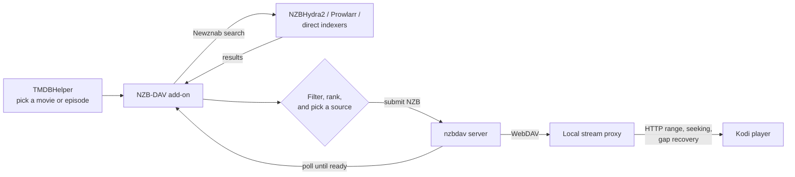

# NZB-DAV for Kodi

**NZB-DAV** turns Usenet into a streaming source inside Kodi. You browse movies
and TV shows in [TMDBHelper](https://github.com/jurialmunkey/plugin.video.themoviedb.helper),
select a title, and NZB-DAV searches your indexers, starts the download on your
[nzbdav](https://github.com/nzbdav-dev/nzbdav) server, and plays the file the
moment it's ready — with a progress bar, seeking, and automatic recovery when a
source goes bad. You never touch an NZB file.

!!! note "This add-on provides software, not content"
    NZB-DAV ships no media and no indexers. You bring your own NZBHydra2 or
    Prowlarr (or direct Newznab indexers), your own nzbdav server, and your own
    Usenet provider. NZB-DAV connects those pieces to Kodi.

## What it does

nzbdav handles both downloading and serving over WebDAV, so you don't need a
separate SABnzbd instance. A background stream proxy inside the add-on gives you
seeking, on-the-fly remuxing, and mid-playback source switching.

## Key capabilities

-   :material-magnify: __Multi-provider search__

    Query NZBHydra2, Prowlarr, or direct Newznab indexers — together or
    individually. Results are merged, de-duplicated, and ranked.

    [:octicons-arrow-right-24: Search and indexers](features/search-and-indexers.md)

-   :material-filter-variant: __Precise quality filtering__

    Filter by resolution, HDR format, audio codec, video codec, language,
    release group, size, and keywords. Rank by relevance, size, or age.

    [:octicons-arrow-right-24: Quality filtering](features/quality-filtering.md)

-   :material-play-speed: __Reliable playback with seeking__

    A local proxy preserves HTTP range seeking, rewrites tail-`moov` MP4s in
    pure Python, and offers optional remux tiers for large or awkward files.

    [:octicons-arrow-right-24: Playback and remux](features/playback-and-remux.md)

-   :material-swap-horizontal: __Self-healing fallback streams__

    If a source loses articles mid-playback, NZB-DAV switches to a verified
    alternate release (matched by length + sampled SHA-256) without stopping or
    rewinding.

    [:octicons-arrow-right-24: Fallback streams](features/fallback-streams.md)

## Get started

If your indexers and nzbdav server are already running, you can be streaming in
a few minutes:

1. [Check the prerequisites](getting-started/prerequisites.md).
2. [Install the add-on](getting-started/installation.md) from the Appz4Fun Kodi
   repository.
3. [Configure your connections](getting-started/configuration.md) and test them.
4. [Set up TMDBHelper](getting-started/tmdbhelper.md) to use NZB-DAV as a player.
5. [Play your first title](getting-started/first-playback.md).

## Compatibility at a glance

| Area | Support |
|------|---------|
| Kodi | 21 (Omega) and later |
| Operating systems | CoreELEC, LibreELEC, OSMC, Windows, macOS, Linux |
| Architectures | ARM64 (aarch64), x86-64 |
| Python | 3.8 and later (runtime is pure Python, no compiled dependencies) |
| Dependencies | None to install — every library is vendored |

!!! tip "Looking for the source or a quick summary?"
    The [README](https://github.com/Appz4Fun/nzbdavkodi#readme) is the short
    version. This site is the complete guide: every setting, every feature, and
    a technical breakdown of [how it all works](how-it-works/architecture.md).
